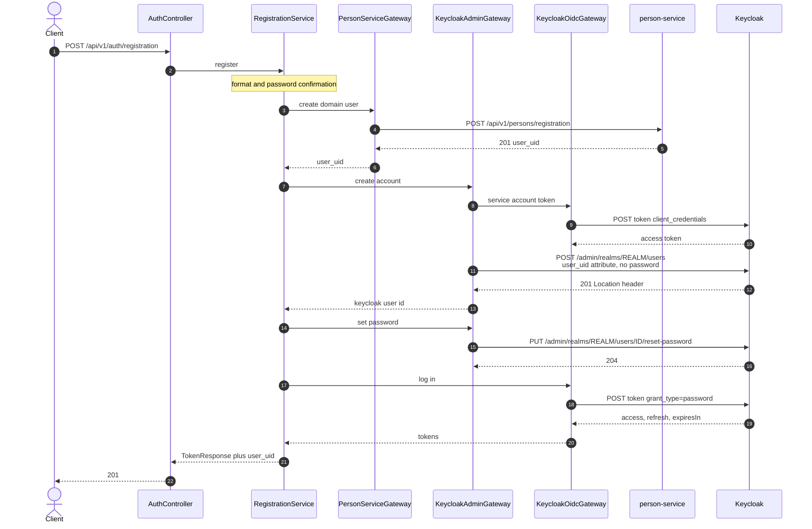
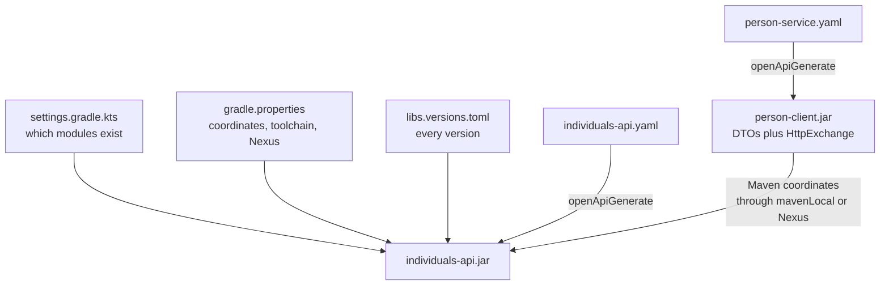
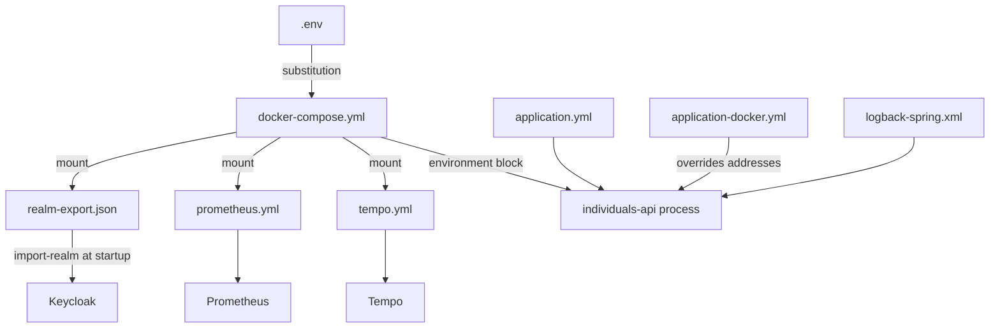
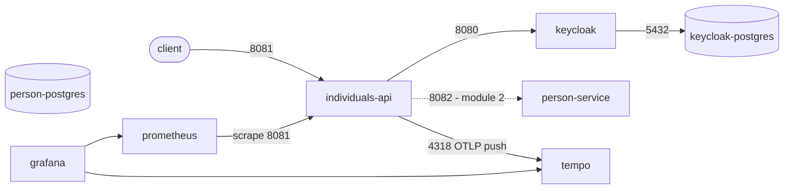

# CONTEXT

Project context for humans and LLMs. Read this first before touching anything.

---

## 1. What this repository is

`payment-platform` — monorepo of the payment platform.

Module 1 delivers **individuals-api**: the external entry layer that
orchestrates user registration and authentication. It stores nothing itself.

| Component | Is the source of truth for |
|---|---|
| `person-service` | the domain user, address, individual data |
| Keycloak | the account, tokens, roles, auth attributes |
| `individuals-api` | nothing — it only coordinates the two above |

**Where a value is stored is not who owns the truth about it.** The same first
name sits in person-service and in the Keycloak account, but only one of them
is the source: the account holds a copy, written once at registration, and
nobody keeps it in step afterwards. Reading a domain field out of Keycloak
because it happens to be there is the easiest way to lose this boundary — see
`/me` in section 5 for where module 1 does exactly that, and why.

The root is deliberately named after the platform, not after one service:
`transaction-service`, `payment-service`, `webhook-collector-service` and
`notification-service` land here in later modules.


### The whole platform, for later modules

Recorded from the course description of the full system, so that later modules
do not drift from it. Only the first two rows exist today.

| Service | Type | Owns | Talks to |
|---|---|---|---|
| **Individuals API** | orchestrator | nothing, no database | Keycloak (Admin + Token API), every domain service |
| **Keycloak** | external IAM | credentials, roles, JWT issuing and validation | - |
| **Users Service** | domain | the business profile: name, country, address | called only through Individuals API |
| **Wallets Service** | domain | wallets and balances, internal transfers | Kafka consumer |
| **Payments Service** | domain | deposit, transfer and withdrawal transactions | Currency Service, Fake Payment Provider, Kafka |
| **Currency Service** | utility | exchange rates from an external provider | called by Payments Service |
| **Webhook Service** | integration | inbound webhooks from the provider | publishes to Kafka, processes nothing itself |
| **Notification Service** | infrastructure | user notifications, plus a REST API to read them | Kafka consumer |
| **Fake Payment Provider** | external stub | imitates a real payment gateway, answers by webhook | - |

Behaviour the description fixes, and that later modules must not invent
differently:

- **Balances change only on Kafka events** (`transaction.completed`,
  `transaction.failed`). Wallets Service never adjusts a balance from a REST
  call.
- **`/init` writes nothing to the database.** A payment transaction is
  persisted only once `/confirm` succeeds.
- **The webhook endpoint is protected by a shared secret**, checked on every
  call.
- **Webhook Service only publishes** `payment.status.updated`; the consumers
  decide what it means.
- Notification Service reacts to events such as `user.registered` and
  `transaction.completed`.

Two integration styles coexist on purpose: synchronous REST where an answer is
needed now, Kafka where the work can finish later. Compensation exists because
of the first style - see "Compensation policy" below.

#### Naming: `person-service` or `users-service`

The module 1 handout names the domain service `person-service`, and this
repository follows it: the Gradle module, the contract, the generated
`person-client` artifact, the `person` database schema and the
`individuals.person-service.*` properties all use that name. The platform
description above calls the same service **Users Service**.

Treated as one service under two names until the course says otherwise. If a
later module requires the second name, the rename touches: `settings.gradle.kts`,
the module directory, `person-service/openapi/person-service.yaml`, the
published artifact coordinates, `PersonsApi`, the Flyway schema, the compose
service `person-postgres`, and `PersonServiceProperties`. It is a mechanical
change, but it is not a small one, so it is not done speculatively.

---

## 2. Fixed technical decisions

These are settled. Do not change them without an explicit decision.

| Decision | Value | Where it lives |
|---|---|---|
| Gradle root project | `payment-platform` | `settings.gradle.kts` |
| Base package | `com.dezxxx.individuals` | — |
| Maven group | `com.dezxxx` | `gradle.properties` |
| Java | 25 (Gradle toolchain, ignores `JAVA_HOME`) | `gradle.properties` |
| Spring Boot | 4.1.0 | `gradle/libs.versions.toml` |
| Gradle | 9.5.1 via Wrapper | `gradle/wrapper/` |
| Lombok | yes — 1.18.46 | root `build.gradle.kts` |
| OpenAPI Generator | 7.14.0 | `gradle/libs.versions.toml` |
| Build tool | Gradle Kotlin DSL only | — |
| Keycloak image | 26.7.2 | `.env` |
| Testcontainers | 2.0.5, inherited from the Boot BOM | artifact ids differ from 1.x — see section 9 |

The Gradle toolchain provisions JDK 25 itself, so whatever `JAVA_HOME` points
at is irrelevant to the build and must not be "fixed" to make it work.

### Version policy

**No version is ever hardcoded in a build script.** Three layers hold them:

| File | Holds |
|---|---|
| `gradle/libs.versions.toml` | every library, plugin and container tag used by the build |
| `gradle.properties` | coordinates, toolchain, Nexus URLs |
| `.env` | image tags, ports and credentials for docker-compose |

---

## 3. Architectural rules

0. **Reactive stack — Spring WebFlux, not Spring MVC.** Required by the
   handout. Netty instead of Tomcat, `Mono`/`Flux` instead of plain return
   types, `WebClient` instead of `RestClient`, `SecurityWebFilterChain` instead
   of `SecurityFilterChain`. Nothing in the service may block the event loop:
   no `.block()`, no blocking JDBC, no blocking HTTP client. Both OpenAPI
   modules are generated with `reactive = true`, so the contracts themselves
   are `Mono`-typed and a blocking implementation would not even compile
   against them.

1. **Contract first, always.** The OpenAPI spec is written before the code.
   Nothing is hand-written that a generator can produce.
   - `individuals-api/openapi/individuals-api.yaml` — server interfaces are
     generated from it; controllers *implement* them, so the code cannot drift
     from the contract.
   - `person-service/openapi/person-service.yaml` — `person-client` generates
     DTOs and `@HttpExchange` clients from it.

2. **No hand-written DTOs.** Every DTO comes out of a generator.

3. **No `project(":...")` dependencies between modules.** Cross-module
   contracts travel as artifacts published to Nexus, addressed by Maven
   coordinates. Modules are `include`d only so one wrapper builds them all.

4. **Transport = Spring HTTP Service Clients + WebClient.** No Feign, and no
   `RestClient` either. `person-client` is generated with
   `library = spring-http-interface`, and the proxies are built with
   `WebClientAdapter` so every call returns a `Mono`. The handout names
   `RestClient`; see the deviations table for why the adapter differs while the
   style does not.

5. **Every build validates the contracts** — `openApiValidate` runs before
   `openApiGenerate`, and `check` depends on it. A broken contract fails the
   build, not the runtime.

6. **Request rules are declared in the contract, not written by hand.** The
   build sets `useBeanValidation = true`, so `@NotNull`, `@Size`, `@Email` and
   the rest are generated straight out of the schema keywords and nobody
   maintains them. OpenAPI has no keyword for "this field equals that one", and
   the confirmation rule is the only place where that matters: it is written as
   a class-level constraint in `validation` and attached to the generated model
   through `x-class-extra-annotation` on the schema. The rule therefore still
   lives in the contract — only its body is in Java — and it is applied by the
   same `@Valid` as everything else, with no call a controller must remember to
   make. Nothing above validates a request a second time.

   **The language of a validation message is left to the machine.** The
   generated constraints answer from Hibernate Validator's own bundles, chosen
   by the JVM default locale, so this service replies in Russian on a Russian
   Windows and in English inside a container — and `must match password`, being
   ours and hard-coded, stays English either way, so one `details` array can
   carry both. Deliberate for module 1: there is one deployment, a local
   machine, and its owner sets its rules. Pinning the language later is a bean
   — a message interpolator fixed to one locale, or one reading the request's
   `Accept-Language` if real localisation is ever wanted — and no other code
   moves.

### individuals-api layers

Mandatory chain, one direction only:

```
rest -> service -> gateway -> external system
```

The first package is `rest`, not `controller`: this service speaks REST and
nothing else — no view layer, no server-rendered page, no message consumer — so
the package is named after the protocol it serves rather than after the Spring
stereotype inside it. `api` was not available, that name belongs to the
generated code.

| Layer | Holds | Never does |
|---|---|---|
| `rest` | accepts and returns DTOs, implements the generated `AuthApi` | business logic; direct calls to Keycloak or person-service |
| `service` | orchestration of the registration and login scenarios | HTTP, JSON, Keycloak or person-client types |
| `gateway` | every outbound call, one gateway per external system | domain decisions |
| `validation`, `error`, `config`, `metrics` | validation rules, error mapping, security wiring, meters | anything belonging to another layer |

Three gateways, no exceptions:

- `PersonServiceGateway` — wraps the generated `PersonsApi`
- `KeycloakAdminGateway` — account creation, password, attributes
- `KeycloakOidcGateway` — token endpoint: login and refresh

**Identifiers.** The business layer knows only the domain `user_uid`. The
Keycloak `sub` is stored as a technical link (`keycloak_user_id`) and never
becomes the platform's primary identifier. Nothing above the gateway layer is
allowed to address a user by it.

**Why gateways rather than repositories.** individuals-api owns no data, so it
has no repository. The gateway takes that seat in the layer chain: an
interface out front, an implementation behind it, injected into the service
through the constructor as a reference type. The rule that Service and
Controller never get invented interfaces of their own still holds.

Patterns in play: `PersonServiceGateway` is an **Adapter** - it translates the
generated client's types into domain types so generated code never leaks
upwards. `KeycloakAdminGateway` is a **Facade** - one method hides the three
Admin API calls that create an account, set its password and write the
`user_uid` attribute.

### Compensation policy

The order - domain user first, Keycloak account second - guarantees no Keycloak
account is ever left without a domain user. The inverse case is real: if the
Keycloak steps fail, the domain user already exists in person-service.

When that happens the service must:

- write a structured error,
- mark the incident as an inconsistent registration,
- return an error to the client,
- never hide the partial failure.

Module 1 uses the simplified form: logging plus an explicit error code. Real
compensating transactions come later in the course. Nothing here silently
retries or pretends the registration succeeded.

### Observability

**Metrics.** Actuator plus Prometheus. Only `health` is exposed over HTTP by
default, so the Prometheus endpoint is turned on explicitly:

```yaml
management:
  endpoints:
    web:
      exposure:
        include: "health,info,prometheus"
  endpoint:
    health:
      probes:
        enabled: true
```

`prometheus.yml` must point at `metrics_path: /actuator/prometheus`.

Required application meters:

| Meter | Type | Meaning |
|---|---|---|
| `auth.registration` | counter | registration attempts |
| `auth.registration.success` | counter | successful registrations |
| `auth.registration.failure` | counter | failed registrations |
| `auth.login` | counter | logins |
| `auth.login.failure` | counter | failed logins |
| `auth.refresh` | counter | token refreshes |
| `external.keycloak.requests` | timer | Keycloak call duration |
| `external.person_service.requests` | timer | person-service call duration |

Named in Micrometer's dotted convention, **not** with the `_total` suffix the
handout table shows. Prometheus appends `_total` to counters itself, so a meter
registered as `auth_registration_total` is scraped as
`auth_registration_total_total`. The handout lists the scraped names; the code
must register the dotted ones.

**Histogram buckets are switched on for `http.server.requests`.** Boot
publishes `count`, `sum` and `max` for its built-in HTTP timer and nothing
else, which is enough for an average and useless for a percentile -
`histogram_quantile` has no buckets to read. The dashboard's 95th percentile
panel had been drawing from data nobody had enabled, and showed an empty graph
without an error anywhere.

An average would have been the wrong fix: nine fast requests and one slow one
average out to "fine", and the slow one is the whole reason the panel exists.
Enabled for that one meter rather than globally - each bucket is its own line
in the scrape, and the built-in HTTP timer is the only place a percentile is
worth that.

**Tracing.** Micrometer Tracing over OpenTelemetry, exported by OTLP:

```yaml
management:
  tracing:
    sampling:
      probability: 1.0
  opentelemetry:
    tracing:
      export:
        otlp:
          endpoint: http://tempo:4318/v1/traces
```

The `management.opentelemetry.tracing.export.otlp.*` namespace is the Boot 4
one - Boot 3 used `management.otlp.tracing.*`. Trace context propagates across
the network only when the HTTP client is built from Spring's autoconfigured
builders, which is another reason the gateways must not construct their own.

**Logs.** JSON to stdout, every record carrying: service name, `traceId`,
`spanId`, request path, HTTP method, response status, business error code, and
the domain `user_uid` when known.

### Keycloak realm

`realm/realm-export.json` must define:

- a realm of its own for the course
- a confidential client for individuals-api
- a service account on that client for the Admin REST API
- a mapper putting `user_uid` into the token, or a consistent way to read it
  through `/me`
- the roles needed to read and manage users (`view-users`, `manage-users` from
  `realm-management`)
- `upConfig` declaring `user_uid` as a user profile attribute — see below

The client secret is a credential: it lives in `.env`, never in the export
committed to git.

#### Why `upConfig` is not optional

Since Keycloak 24 the declarative user profile is always on, and unmanaged
attributes are **disabled** by default. An attribute that the profile does not
declare is dropped silently: `POST /admin/realms/{realm}/users` still answers
`201`, the account is created, and the attribute is simply not there. No error,
no warning. The protocol mapper then has nothing to map and the claim never
appears in the token.

That is exactly what happened here, and it was invisible until a token was
decoded. The fix is to declare `user_uid` in `upConfig`. Declaring `upConfig`
replaces the whole default profile, so `username`, `email`, `firstName` and
`lastName` have to be listed again with their original validations.

Editing the user profile needs `manage-realm`, which our service account
deliberately does **not** have — it is configuration, not runtime work, so it
belongs in `realm-export.json` and nowhere else.

#### Verified against a running Keycloak 26.7.2

Checked end to end after a `down -v` and a fresh import:

| Check | Result |
|---|---|
| `client_credentials` on `individuals-api` | token issued — client is confidential, secret matches `.env`, service account is on |
| `GET /admin/realms/{realm}/users` with that token | `200` — `view-users` really is granted |
| create user with `credentials` + `attributes` in one call | `201`, account complete |
| password grant as that user | tokens issued, and `user_uid` present as a claim |
| same, but `"temporary": true` | `400 invalid_grant`, `Account is not fully set up` |
| create a second user with an existing email | `409`, `User exists with same email` |
| password grant with a wrong password | `400 invalid_grant`, `Invalid user credentials` |

Two consequences for the gateway code:

- Keycloak answers a bad password with **400**, not 401. `KeycloakOidcGateway`
  translates it: our contract says 401, and the client must never see 400 here.
- `400 invalid_grant` covers both a wrong password and a not-fully-set-up
  account. The status code alone cannot tell them apart — only
  `error_description` can. Log the description, return 401.

### Deviations from the course handout, and why

| Handout | Here | Reason |
|---|---|---|
| `generatorName("java")` | `"spring"` + `library("spring-http-interface")` | the same handout mandates Spring HTTP Service Clients, not a generic Java client |
| `$buildDir` | `layout.buildDirectory` | `$buildDir` was removed in Gradle 9 — the handout snippet does not compile here |
| spec kept in `common/` | spec kept in the module that owns it | matches the artifact table: `person-service/openapi/person-service.yaml` |
| Spring Boot 4.0.6 | 4.1.0 | 4.1.0 reached GA after the handout was written |
| `proselyte` / `com.example` | `dezxxx` / `com.dezxxx` | handout placeholders |
| Tempo traces under `/tmp/tempo/traces` | `/var/tempo`, with an explicit wal path | that is where docker-compose mounts the named volume; under `/tmp` the traces die with the container and the volume stays empty |
| `RestClient` as the standard HTTP client (and `Feign/OpenAPI` on the platform diagram) | Spring HTTP Service Clients over `WebClientAdapter` | The **style** the handout mandates - annotated `@HttpExchange` interfaces behind generated proxies - is followed exactly; `person-client` is generated from the OpenAPI document with `library = spring-http-interface`. Only the adapter differs. `RestClient` is synchronous and `RestClientAdapter` cannot return `Mono` at all, so adopting it would mean regenerating the client with `reactive = false` and wrapping every call in `Mono.fromCallable(...).subscribeOn(boundedElastic())`. A bare call would park a Netty event loop thread that serves hundreds of connections. The same handout's C4 diagram labels this service **Spring Boot WebFlux**, and the two requirements pull against each other; the reactive adapter is the one that keeps WebFlux worth having |
| postgres volume at `/var/lib/postgresql/data` | `/var/lib/postgresql` | PostgreSQL 18 moved the data directory one level down and refuses to start when the old path is mounted — the container exits with code 1 |

---

## 4. Registration flow (the core scenario)

Eight steps, in this order. The order **is** the design, not an implementation
detail: person-service goes first because it issues the identity, and a refusal
from it leaves nothing to undo anywhere.

1. `individuals-api` accepts the registration request
2. validates format and password confirmation
3. `POST /api/v1/persons/registration` — person-service creates the domain user
4. it answers with `user_uid`, the identifier the whole platform will use
5. obtains a service-account token (`client_credentials`)
6. `POST /admin/realms/{realm}/users` — creates the account, **without a
   password**, carrying `user_uid` as a user attribute
7. `PUT /admin/realms/{realm}/users/{id}/reset-password` — sets the password
8. logs in via `/realms/{realm}/protocol/openid-connect/token` (`password`) and
   returns access token, refresh token, lifetime and `user_uid`

Step 6 body — note what is *not* in it:

```json
{
  "username": "user@dezxxx.com",
  "email": "user@dezxxx.com",
  "firstName": "Ivan",
  "lastName": "Ivanov",
  "enabled": true,
  "emailVerified": false,
  "attributes": { "user_uid": ["6f1d2a4e-8c3b-4a7f-9e2d-1b5c7a9f0e33"] }
}
```

The account is created with **201** and an empty body; the new id exists only in
the `Location` header, and parsing it out is `KeycloakAdminGateway`'s job.

Step 7 body:

```json
{ "type": "password", "value": "Str0ngP@ssw0rd", "temporary": false }
```

`temporary: false` is mandatory. A temporary password makes Keycloak attach the
`UPDATE_PASSWORD` required action, and step 8 then fails with
`400 invalid_grant: Account is not fully set up` — after everything else looked
successful.

**Keycloak could accept the password inside step 6**, in a `credentials[]`
array, saving one round trip and making account creation atomic. The handout
names the `reset-password` endpoint explicitly, so the two-call form is what is
implemented; the cost is the gap described below.

### Where it can break, and what the client is told

| Where | Client sees | Created so far |
|---|---|---|
| `@Valid` | **400** `VALIDATION_ERROR`, one `details[]` line per bad field | nothing |
| person-service `409` | **409** `USER_ALREADY_EXISTS` | nothing |
| person-service `5xx` | **503** `DEPENDENCY_UNAVAILABLE` | nothing |
| person-service `400` | **500** `INTERNAL_ERROR` — their validation and ours disagree, which is our bug | nothing |
| *— `user_uid` issued; from here every failure splits the two systems —* | | |
| Keycloak create | **503** `REGISTRATION_INCONSISTENT` | domain user |
| Keycloak reset-password | **503** `REGISTRATION_INCONSISTENT` | domain user; the incomplete account is deleted |
| login | **503** `DEPENDENCY_UNAVAILABLE` | everything — **not** an inconsistency |

The last row is the subtle one. If only the login failed, both systems hold the
same user and the account works; we merely failed to hand tokens over, and the
caller can log in normally.

**Compensation.** A failure at step 7 leaves an account that can never be logged
into while its address stays taken, so registering it again would answer **409**
for good. `RegistrationService` deletes that account, which frees the address.
The domain user is **not** rolled back — person-service exposes no delete — so
the split is logged with the `user_uid` and reported as
`REGISTRATION_INCONSISTENT`. That is module 1's accepted limit, and the handout
allows it: logging plus an explicit error code.



---

## 5. External API

| Method | Path | Auth |
|---|---|---|
| POST | `/api/v1/auth/registration` | none |
| POST | `/api/v1/auth/login` | none |
| POST | `/api/v1/auth/refresh-token` | none |
| GET | `/api/v1/auth/me` | Bearer |

### What each endpoint does

**`POST /registration`** — creates the domain user, then the Keycloak account,
then logs in on the caller's behalf so the client never has to send a second
request. Answers `201` with `TokenResponse`. A duplicate email is a `409`, and
it can be raised by either side: `person-service` may already hold that email,
and Keycloak answers `User exists with same email` with its own `409`. Both map
to the same `409` outward — the client does not care which store objected.

**`POST /login`** — no database of ours is touched. Email and password go
straight to Keycloak as `grant_type=password`; on success `200` with
`TokenResponse`. Bad credentials come back from Keycloak as `400 invalid_grant`
and are translated to `401`.

**`POST /refresh-token`** — a thin wrapper over `grant_type=refresh_token`.
Keycloak normally rotates the refresh token too, so both tokens in the response
are fresh. `200` on success; an expired or revoked token is `401`.

**`GET /auth/me`** — protected. Spring Security validates the JWT against the
realm's JWKS, then the service reads `sub` from it and calls
`GET /admin/realms/{realm}/users/{id}` through `KeycloakAdminGateway`.

The call to Keycloak is deliberate, not laziness about parsing the token. A JWT
is a snapshot from the moment it was issued and stays valid for its lifetime, so
a token alone cannot tell us whether the account was disabled or deleted a
minute ago; the Admin API can. It also carries fields the token does not, such
as the creation timestamp. If the account is gone, `/me` answers `404`; if the
token itself is bad or expired, `401`.

The roles in `CurrentUserResponse` are read from the token's `realm_access`, not
from a second Admin API call — they are already there and cost nothing.

**`firstName` and `lastName` are answered from the account, and that is a debt
of module 1, not the architecture.** They are domain fields; person-service
owns the truth about them. individuals-api writes a copy into Keycloak at
registration only so the claims exist, and after that nothing keeps the copy in
step — a name changed in the domain profile will not show up here until the
account is updated too. Module 1 has no read side to ask: `person-service` is
migrations and a frozen contract, with no operation to fetch a profile. When
module 2 opens one, `/me` should take the profile from person-service and keep
only `sub`, `roles` and `email_verified` from the token — those are genuinely
facts about the account. The contract says as much on both fields, so a client
is not misled in the meantime.

`registeredAt` is declared in `CurrentUserResponse` and comes from Keycloak's
`createdTimestamp`, which is epoch milliseconds. `KeycloakAdminGateway` converts
it to UTC and its method is `findRegisteredAt`, returning `Mono<OffsetDateTime>`
— no layer above the gateway sees the raw number, and none of them holds a
Keycloak payload either. The record it is parsed into,
`KeycloakUserRepresentation`, is package-private and carries that one field;
it is named after Keycloak's own model so the name can be looked up in their
reference.

### Port map

Host ports, as fixed by the course handout. Values live in `.env`, never in
`docker-compose.yml`.

| Service | Host | Container |
|---|---|---|
| keycloak | 8080 | 8080 |
| individuals-api | 8081 | 8081 |
| keycloak-postgres | 5433 | 5432 |
| person-postgres | 5434 | 5432 |
| prometheus | 9090 | 9090 |
| tempo | 3200, 4318 | 3200, 4318 |
| loki | 3100 | 3100 |
| alloy | - | - |
| grafana | 3000 | 3000 |

`person-service` gets 8082 in module 2 - not from the handout, chosen because
8081 is taken. The OpenAPI `servers` entries follow this table.

**Nexus runs on 8083, not on its own default 8081.** The handout fixes 8081 for
individuals-api, so Nexus is the one that has to move; the URLs live in
`gradle.properties`. Until Nexus is up, that unreachable repository is also why
IntelliJ reports `Sources were not downloaded for ...`: an ordinary build finds
the jar in Maven Central and never reaches the third repository, but the IDE
asks every repository for sources and reports the whole lookup as failed.

---

## 6. Module layout

```
payment-platform/
├── settings.gradle.kts        includes modules, Nexus + mavenLocal resolution
├── build.gradle.kts           shared conventions (toolchain, Lombok, tests)
├── gradle.properties          coordinates, toolchain, Nexus
├── gradle/libs.versions.toml  every version
├── docker-compose.yml
├── .env                       image tags, ports, credentials (not in git)
├── infra/                     prometheus, tempo, grafana provisioning
├── postman/                   collection: every endpoint and its failures
├── docs/                      PlantUML diagrams (component, deployment,
│                              registration sequence, layers) and
│                              DEMO.md - the end-to-end walkthrough
│                              CHEATSHEET.md - ports, credentials, commands
│                              CLASSES.md - one line per class
│                              demo/ - the person-service stub DEMO.md uses
├── person-client/             generated DTOs + HTTP clients -> Nexus
├── individuals-api/           the orchestrator
└── person-service/            contract + Flyway migrations only (module 2)
```

---

## 7. Build order

`person-client` must exist as an artifact before `individuals-api` resolves.
Until Nexus is up, `mavenLocal()` covers it:

```bash
./gradlew :person-client:publishToMavenLocal
./gradlew build
```

---

## 8. Progress — module 1

### Acceptance criteria

The module is accepted only when every line below is true. These are the
handout's, verbatim in meaning.

| # | Criterion |
|---|---|
| 1 | the monorepo contains individuals-api and person-service |
| 2 | the OpenAPI contracts exist and pass `openApiValidate` |
| 3 | registration works through the orchestration scenario |
| 4 | `user_uid` is written into Keycloak as a user attribute |
| 5 | `/login`, `/refresh-token` and `/me` work |
| 6 | the HTTP client with its DTOs is published to Nexus |
| 7 | `docker compose up --build` brings up the infrastructure and the app |
| 8 | `/actuator/health` and `/actuator/prometheus` are reachable |
| 9 | traces are visible in Grafana/Tempo |
| 10 | unit and integration tests exist |
| 11 | the main scenario is covered at 80% or better on the key services |
| 12 | README.md and CONTEXT.md are written |

Criterion 11 needs a coverage tool, and the build has none yet - JaCoCo is on
the list below. **JaCoCo is not named by the handout**; the 80% figure is, and
JaCoCo is simply what measures it.

### The student's own checklist

Twelve checks the handout hands over separately from the criteria above. They
overlap, but not completely: several of these are about *where a thing lives*
rather than whether it works, which no test can fail for us.

| # | Check | Where it stands |
|---|---|---|
| 1 | OpenAPI describes every external method and every error | ✅ all four operations, shared `ErrorResponse`, examples on each |
| 2 | no DTO written by hand over a contract that already describes it | ✅ `useBeanValidation` + generated models only; `git grep` finds no hand-written model |
| 3 | individuals-api stores no domain data of the user | ✅ no database at all - see §1, and the `/me` debt in §5 |
| 4 | person-service is named as the source of domain truth | ✅ §1, first table |
| 5 | `user_uid` runs end to end and is never replaced by `sub` | ✅ enforced by IT-KC-002, which compares against the value person-service issued |
| 6 | every outbound call is inside a gateway | ✅ `gateway/` is the only package holding a foreign payload |
| 7 | metrics reachable through `/actuator/prometheus` | ✅ IT-OBS-001 |
| 8 | traces leave over OTLP to Tempo | ✅ IT-OBS-002 asserts the push; Tempo's own indexing verified by hand on the live stack |
| 9 | logs are JSON and carry correlation | ✅ ECS to stdout, `traceId` and `spanId` on every record - IT-OBS-003 |
| 10 | at least one integration test against Keycloak | ✅ three |
| 11 | person-service migrations are attached and runnable | ✅ IT-DB-001 runs them on a real PostgreSQL |
| 12 | `person-client` is published to Nexus | ❌ only `publishToMavenLocal`; same gap as criterion 6 |

Eleven of twelve. The one that is open is the one open acceptance criterion
too, plus criterion 11's coverage number - everything else the handout asks
for is done and proven rather than asserted.

### Mandatory test cases

**Unit** - orchestration, validation, error mapping, conflicts, parsing the
answers of external systems.

| Code | Scenario | Expected |
|---|---|---|
| UT-REG-001 | valid registration request | person-service is called first, then Keycloak, then tokens are returned |
| UT-REG-002 | password and confirmation differ | 400, Keycloak is never called |
| UT-REG-003 | person-service reports an email conflict | 409, Keycloak is never called |
| UT-REG-004 | domain user created, Keycloak unreachable | 502/503, the partial failure is recorded |
| UT-LOG-001 | successful login | access and refresh tokens returned |
| UT-LOG-002 | wrong password | 401 |
| UT-REF-001 | successful token refresh | a new access token is returned |
| UT-ME-001 | valid bearer token | the current user is returned |

**Integration** - containers, real HTTP against Keycloak, tokens, actuator,
tracing.

| Code | Scenario | Expected |
|---|---|---|
| IT-KC-001 | registration against a real Keycloak container | the user appears in the realm |
| IT-KC-002 | after registration | the `user_uid` attribute is found in Keycloak |
| IT-KC-003 | `/login` against the real token endpoint | a real JWT comes back |
| IT-OBS-001 | `/actuator/prometheus` | Prometheus metrics are readable |
| IT-OBS-002 | after a request | a trace is visible in Tempo/Grafana |
| IT-OBS-003 | log records | carry `traceId` and `spanId` |
| IT-DB-001 | person-service migrations against PostgreSQL | Flyway succeeds |

**Where these classes must live.** `individuals-api/build.gradle.kts` filters
`test` to `com.dezxxx.individuals.unit.*` and `integrationTest` to
`com.dezxxx.individuals.integration.*`. A test placed anywhere else runs in
neither task and fails silently by never running at all.

### Done

- [x] Monorepo root `payment-platform`, git on `main`
- [x] Directory skeleton for all modules
- [x] `.gitignore`
- [x] `gradle/libs.versions.toml` — every version extracted
- [x] `gradle.properties` — coordinates, toolchain, Nexus
- [x] `settings.gradle.kts` — modules, Nexus + mavenLocal, placeholders for the
      next course modules
- [x] Root `build.gradle.kts` — toolchain 25, Lombok, test conventions
- [x] Gradle Wrapper 9.5.1
- [x] `person-client/build.gradle.kts` — generate + publish to Nexus
- [x] `individuals-api/build.gradle.kts` — Boot app, contract-first, split
      unit / integration test tasks
- [x] `person-service/build.gradle.kts` — contract validation only
- [x] `individuals-api/openapi/individuals-api.yaml` — 4 endpoints, shared
      error model, payload examples on every external method
- [x] `person-service/openapi/person-service.yaml` — the 3 frozen operations,
      schemas mirroring the DDL, same shared error model
- [x] Flyway `V001__init_person_schema.sql`
- [x] Flyway `V002__seed_countries.sql` — all 249 ISO 3166-1 entries
- [x] `.env` + `.env.example` + `docker-compose.yml` — images pinned, ports per
      the handout table
- [x] **First real `./gradlew build` — green.** See section 9.
- [x] `application.yml` / `application-docker.yml` / `logback-spring.xml`
- [x] `realm/realm-export.json` — realm, confidential client, service account,
      `user_uid` mapper, `upConfig`, realm-management roles
- [x] `individuals-api/Dockerfile` (never built yet)
- [x] `infra/` — prometheus, tempo, loki, alloy, grafana provisioning
- [x] `error/` — 7 classes, both roads (advice and security handlers)
- [x] `config/` — security, HTTP clients, Keycloak and person-service properties
- [x] `gateway/` — all three gateways required by the handout, plus the two
      error translators and `GatewayErrors`
- [x] `RegistrationService` — the eight-step scenario with compensation
- [x] `AuthenticationService` — login, refresh, `/me`
- [x] `README.md` — first version: what it is, the four endpoints, how to run
      it, and an honest status table
- [x] `docs/CHEATSHEET.ru.md` — the operations sheet finally has its mirror
- [x] `docs/CLASSES.md` + `docs/CLASSES.ru.md` — every class, its one
      job, and the rule that decides which package a new class goes into
- [x] `validation/` — `PasswordsMatch` and its validator, attached to the
      generated model from the contract; three tests, run through a real
      `Validator` so a rule that stops reaching the class cannot pass silently
- [x] `testRuntimeOnly(libs.junit.platform.launcher)` — the catalog entry had
      been there unused, and without it the test JVM refused to start at all,
      so no test in this module had ever run
- [x] `rest/AuthController implements AuthApi` — the four endpoints are served.
      **First live run of the API**, against a Keycloak in Docker: health
      **200**; `/me` without a token **401** in the contract's error shape; a
      mismatched confirmation **400** carrying
      `confirmPassword: must match password`; a well-formed registration
      **503**, having reached person-service, which is not running; an unknown
      login **401**, translated from Keycloak's `invalid_grant`
- [x] `RegistrationServiceTest` — six cases, given/when/then. Found a real
      defect on the first run: `then(login(...))` evaluates its argument while
      the chain is assembled, so the gateway was called before the password
      was set and even on registrations that failed. Harmless only because the
      gateway builds a lazy `WebClient` chain; fixed with `Mono.defer`
- [x] `metrics/AuthMetrics` — all eight meters, verified live in Prometheus
- [x] **`docker compose up` brings up the whole stack.** Nine services, and
      three defects surfaced in the process - see below
- [x] Four Grafana panels for our own meters. The provisioned dashboard drew
      only Spring's built-in `http_server_requests_*` and knew nothing about
      `AuthMetrics` - the meters existed and no panel looked at them, which is
      the failure mode the "a metric name is a contract" rule warns about
- [x] **The public prefix is `/api/v1/auth/...`, not `/v1/auth/...`.** The
      handout's own endpoint table omits the prefix while its curl examples and
      its `@HttpExchange("/api/v1/persons")` example both carry it; two
      independent places against one, and `person-service.yaml` was already on
      `/api/v1/persons`, so the repository had been contradicting itself.
      Caught by a counter: `/api/v1/auth/login` answered **401** exactly like
      the real path, because an unknown path is not in `permitAll` and the
      security entry point translates any filter rejection into
      `INVALID_CREDENTIALS`. The bodies were identical - only
      `auth_login_total` showed that one of the two never reached the service
- [x] `integrationTest` no longer fails the build. Gradle fails a `Test` task
      whose filter matches nothing, and `check` depends on it, so
      `./gradlew build` had been red since the JUnit launcher was wired in -
      the task had simply never been reached before that
- [x] **`logging/` - the fields the module requires on every record.** Three of
      the eight were there; the path, method, status, business error code and
      `user_uid` lived only inside the text of one message, and only on records
      written by `GlobalExceptionHandler`. `RequestLog` now travels in the
      Reactor Context and is copied into the MDC on every signal, because the
      MDC is thread-local and a reactive chain hops threads on each outbound
      call. That copy only happens when `spring.reactor.context-propagation` is
      exactly `auto`, which had never been set - an integration test proved the
      records come out with no trace id on the default. Set in
      `application.yml`, where production needs it too. A comment in that file
      had claimed the application already did all of this; it did not, and
      there was no MDC call anywhere in `main`
- [x] **Every test case the handout requires - all fifteen codes, 22 unit and
      11 integration, green.** `AuthenticationServiceTest` closes UT-LOG-001,
      UT-LOG-002, UT-REF-001 and UT-ME-001; `KeycloakRegistrationIT`,
      `ObservabilityIT` and `PersonSchemaMigrationIT` close the seven IT codes.
      person-service is stubbed on reactor-netty, since module 1 does not
      contain it, and Tempo is stubbed too - whether Tempo indexes what it is
      given is Tempo's promise, ours ends at the socket. Each code opens the
      `@DisplayName`, so a Gradle report matches the handout without guessing
- [x] **`REGISTRATION_INCONSISTENT` answers 503, not 500.** UT-REG-004 fixes
      502 or 503 for "domain user created, Keycloak unreachable". The case for
      500 was that the split is ours rather than the dependency's, and that 503
      invites a retry now guaranteed to answer **409 (Conflict)**; the
      acceptance criteria win, and both sides are recorded on the constant. The
      test asserts the status rather than only the code - the mismatch had
      survived precisely because nothing did
- [x] `spring-boot-testcontainers` removed. Declared and never used:
      `@ServiceConnection` has nothing to attach to here, since Keycloak comes
      from a third party and the application opens no datasource of its own
- [x] **JaCoCo, and criterion 11 answered with a number: the key services are
      at 100%.** Generated code is excluded - `com.dezxxx.individuals.api` is
      models with getters, and counting them would move the percentage a long
      way while saying nothing. Both suites feed the report, because a gateway
      is exercised only by the integration tests. The 80% rule is scoped to
      `com.dezxxx.individuals.service` on purpose: a repository-wide average
      would hide a bare `RegistrationService` behind a well covered `config`.
      What the report showed beyond the criterion: `gateway.keycloak` is at
      **0%** - its error translator only runs when Keycloak answers with a
      failure, and no test of ours makes it do that
- [x] **Nexus is in compose, and `person-client` really comes from it.**
      Publishing was proven by removing the artifact from `~/.m2` and from
      Gradle's cache and rebuilding with `--refresh-dependencies`: the build
      passed, and the only place left to get `com.dezxxx:person-client` from
      was Nexus. Closes criterion 6 and the last line of the student checklist.
      Three things had to be sorted out on the way:
      1. **Nexus answers an unauthenticated read with 403, not 401**, and
         Gradle only retries with credentials after a 401. Fixed with
         `authentication { create<BasicAuthentication>("basic") }` in both
         places - the publish repository and the resolve repository.
      2. **Community Edition refuses to serve repository content until its
         EULA is accepted**, answering 403 with an explanatory body. Accepted
         once, in the browser; the state lives in the `nexus-data` volume.
      3. The container's own port stays 8081 internally and is published on
         8083, because the handout gives 8081 to individuals-api.
      Upgrading the image from 3.87.1 to 3.96.1 kept the volume, the EULA and
      the published artifact - so the repository survives a version change, not
      only a restart.

- [x] **Every account gets the `USER` role, and `/me` answers with it alone.**
      The role was declared in the realm export and granted to nobody. Two
      declarative routes were tried and neither works: Keycloak builds its own
      `default-roles-<realm>` composite before it reads ours and keeps its own,
      and `realmRoles` in the create-user body is accepted with **201** and
      ignored. So `KeycloakAdminGateway.assignPlatformRole` grants it - two
      calls, because Keycloak resolves a role mapping by id and the id is known
      only after reading the role. Granted after the password, inside the block
      that compensates, so a failure there removes the half-made account like
      any other.
      That surfaced a missing permission: the service account had `view-users`,
      `query-users` and `manage-users`, but reading a realm role needs
      `view-realm`. Without it registration answered **503**, which is also the
      real reason a duplicate address did - not the missing person-service.
      `/me` filters Keycloak's own three roles out of the answer: they say what
      an account may do inside Keycloak, and a client reading `roles` is asking
      a business question.
- [x] `details` is always an array, empty when there is nothing to report. The
      handout's error example shows one, and a client that checks the length
      before reading `details[0]` then behaves the same on every error instead
      of telling an absent field from an empty one.
- [x] **Postman collection** - required by the handout's artifact list, which
      the acceptance criteria do not mention. Ten requests: the four endpoints
      in the order a person walks them, four failures, and the two actuator
      paths the module is judged on. Nothing is copied by hand - registration
      generates a fresh address and stores the tokens, so the whole run is one
      click. Verified with `newman`: 31 assertions, green.

The Dockerfile still uses `publishToMavenLocal` rather than Nexus, and that is
deliberate: `docker build` has no route to `localhost:8083`, which inside the
builder means the builder itself. The image stays self-contained, and Nexus is
what the build on the host resolves through.

### Two failures share 401, and the code is what tells them apart

`AUTHENTICATION_REQUIRED` - no usable token: none sent, expired, signed by an
unknown key, or a path that does not exist, since anything outside the public
list has to be authenticated before it can be routed.

`INVALID_CREDENTIALS` - a password was compared and did not match. The login
flow, and nothing else.

`REFRESH_TOKEN_INVALID` - the refresh token is spent: expired, already used,
or revoked. Keycloak answers `invalid_grant` to this and to a wrong password
alike, so the gateway cannot tell them apart; `AuthenticationService.refresh`
can, because no password reached it. A client reads this one as "the session
ended, show the login form".

Until this was split, `ApiAuthenticationEntryPoint` mapped every filter-chain
rejection to `INVALID_CREDENTIALS`, so a typo in a URL answered *"Email or
password is incorrect"* on a request that carried no password at all. The
status was right - **401 (Unauthorized)** is what a resource server owes an
unauthenticated caller - and the message sent the reader looking in the wrong
place.

**A path that does not exist still answers 401, not 404, and that is
deliberate.** Answering "no such path" to an unauthenticated caller maps out
the API for anyone who asks. `ErrorContractIT` pins both this and the split.

### What the first full compose run cost

The Dockerfile, `infra/tempo/tempo.yml` and the OTLP metrics registry had never
been exercised. All three were broken:

1. **The image did not build at all.** `publishToMavenLocal` and `bootJar` were
   asked for in one Gradle invocation; Gradle resolved individuals-api's
   compile classpath before the publish had written anything, fell through to
   the Nexus that does not exist inside the container, and died. Split into two
   invocations. Note for later: the Nexus URL is `localhost:8083`, which inside
   a container means the container itself - it will need the compose service
   name when Nexus arrives.
2. **Tempo accepted no traces.** The app was exporting to the right address and
   getting "connection refused" while Tempo answered `ready` on 3200. Tempo
   embeds the OpenTelemetry receiver, and since collector 0.104 an omitted
   `endpoint` binds to localhost rather than 0.0.0.0 - so the receiver was
   listening only to itself. Written out explicitly.
3. **A failed metrics push every minute.** The OpenTelemetry starter brings an
   OTLP meter registry along with the tracing it is there for, and it pushed to
   a receiver that does not exist - a stack trace a minute, forever. Prometheus
   collects ours by scraping, so the second copy is off:
   `management.otlp.metrics.export.enabled: false`.

Verified afterwards, end to end: Prometheus scrapes all eight meters and
returns the same numbers the app reports; Loki holds our JSON logs with
`traceId` and `spanId` promoted to labels; Tempo answers searches for
`service.name=individuals-api` with traces carrying the security filter chain's
spans.

### Next up, in this order

**Every acceptance criterion is met, every line of the student's checklist is
ticked, and every artifact the handout asks for exists.** What is left is not
required by it:

- [ ] A test for `KeycloakErrorTranslator`, which JaCoCo reports at 0%. Not a
      criterion either, but it is the one piece of our own code that nothing
      has ever executed

### Working agreements

- No commit or push without explicit approval, every time.
- Commit author is always `Sergey Zatulsky <web7tudio@gmail.com>`.
- Commit messages in English, `type: short description`.
- Communication in Russian, code and comments in English.
- `CONTEXT.md` and `CONTEXT.ru.md` are edited together; English is the source
  of truth if the two ever disagree.
---

## 9. First build run — what it cost

`./gradlew build` had never been executed before 2026-08-19. Versions had been
checked against Maven Central by hand, but nothing had been resolved for real.
Seven defects surfaced; all are fixed and the build is green from `clean`.

| # | Symptom | Root cause | Fix |
|---|---|---|---|
| 1 | Wrapper could not download the distribution, `Connect timed out` after 10 s | `services.gradle.org` redirects to GitHub release assets; `networkTimeout=10000` with `retries=0` gave up on the first slow connect | `networkTimeout=120000`, `retries=3`, `retryBackOffMs=2000` |
| 2 | `Could not resolve com.dezxxx:person-client` → `Username must not be null!` | the `credentials { }` block was declared unconditionally; Gradle treats null credentials as a hard error, not as an unreachable repository, and aborts the whole resolution | credentials attached only when `NEXUS_USERNAME` **and** `NEXUS_PASSWORD` are set — in `settings.gradle.kts` and in the `person-client` publish repo |
| 3 | `Configuration cache state could not be cached` | downstream of #2 — an unresolvable classpath cannot be serialised | disappeared with #2 |
| 4 | `sourcesJar` used the output of `openApiGenerate` without declaring a dependency | the generated directory was added to `sourceSets` as a bare path, so only the hand-wired `compileJava` knew about it | the srcDir is now wired to the task provider, so every consumer inherits the dependency |
| 5 | `TemplateNotFoundException: pom-sb3.mustache` | the generator tried to emit a Maven `pom.xml` as a supporting file; the `spring-http-interface` library ships no such template | `globalProperties = { apis, models }` — APIs and models only, no supporting files |
| 6 | `package org.springframework.format.annotation does not exist` | generated models annotate date-time properties with `@DateTimeFormat`, which lives in `spring-context`, not `spring-web` | `spring-context` added to the catalog and to `person-client` |
| 7 | `Could not find org.testcontainers:junit-jupiter:` (empty version) | Boot 4.1 imports **Testcontainers 2.0.5**, and 2.x renamed every module artifact | `testcontainers-junit-jupiter`, `testcontainers-postgresql` |

Two more things the run settled:

- `val integrationTest by tasks.registering(...)` is deprecated as of Gradle 9.6
  and would not survive Gradle 10. Rewritten as
  `tasks.register<Test>("integrationTest")`. The build now reports no
  deprecations at all.
- `bootJar` failed with *"Main class name has not been configured"* — expected,
  since no application class existed yet. `IndividualsApiApplication` was added.

### Verified, not assumed

- Gradle 9.5.1 runs the whole build; 9.7.1 was verified to exist and work too,
  but is held back by the IDE — see "Why Gradle 9.5.1" below.
- Spring Boot 4.1.0, OpenAPI Generator 7.14.0, Lombok 1.18.46 all resolve.
- `person-client` generates `PersonsApi` with `@HttpExchange` — Spring HTTP
  Service Clients, no Feign, as rule 4 requires.
- `individuals-api` generates `AuthApi` as an interface only.
- All three specs pass `openApiValidate`.
- `clean build` runs from clean and produces `individuals-api.jar`.

### Known noise, not defects

- ~100 deprecation warnings from generated sources: OpenAPI Generator 7.14.0
  emits `org.springframework.lang.@Nullable`, deprecated in Spring 7. Harmless;
  worth silencing on the generated source set rather than in the generator.
- `Ignoring complex example on request body` — the generator does not carry
  multi-example blocks into code. The examples stay in the contract, which is
  where the handout wants them.

### Contract alignment with the handout

`ErrorResponse` now matches the model the handout fixes for the whole course:
`required` is `[timestamp, path, status, error, message, traceId]`, and
`details` is an **array of strings**. The earlier `ErrorDetail` object carried
more structure, but five services will share this model — consistency wins.
Field information survives as `"confirmPassword: must match password"`.

`UserResponse` was renamed to `CurrentUserResponse` to match the handout's
required schema list.

### Why Gradle 9.5.1 and not the latest

The wrapper was originally pinned to 9.7.1, which is the current Gradle
release. The build works on it. IntelliJ IDEA 2025.2.6 does not: its Kotlin
plugin loads the script *templates* from the Gradle distribution but never
produces the per-script model, so every `build.gradle.kts` shows as fully
unresolved in the editor — down to `mapOf` and `to` from the Kotlin standard
library — while `./gradlew build` stays green.

The build files are not at fault and were not changed: dropping the wrapper to
9.5.1 and re-syncing cleared the editor on its own.

Revisit when IDEA ships support for Gradle 9.7. Moving back is one line in
`gradle/wrapper/gradle-wrapper.properties` — nothing in the build depends on
the version.

---

## 10. Configuration map

The same four views exist as PlantUML in `docs/` - `component.puml`,
`deployment.puml`, `registration-sequence.puml` and `layers.puml` - for the
IDE plugin. The Mermaid below is the copy that renders on GitHub without one.
When one changes, change the other.

`observability.puml` is a fifth, and it answers a different question: which of
the three - metrics, logs, traces - answers what, which direction each one
travels, and what ties them together. Open that one when they start blurring
into "the monitoring".

The files here work at two different times and mostly do not know about each
other. What binds them is a handful of values that must agree - and those are
exactly the places that break silently.

### Build time - no containers exist yet



The OpenAPI specs live only here. At runtime nothing reads them - the code was
already generated from them.

### Run time - who reads what



`.env` is substituted into the compose file itself. It does **not** reach the
container - only the `environment:` block does. That is why individuals-api
lists `KEYCLOAK_REALM`, `KEYCLOAK_CLIENT_ID` and `KEYCLOAK_CLIENT_SECRET`
explicitly.

### Run time - who talks to whom



Two opposite mechanics, and they are easy to confuse. **Prometheus pulls** -
it walks to the application on a schedule, so the application's address lives
in `prometheus.yml`. **The application pushes** traces, so Tempo's address
lives in `application.yml`. One arrow points each way.

### Values that must agree

Every row is a place where a mismatch breaks something without raising an
error anywhere.

| Coupling | One side | Other side | What must match |
|---|---|---|---|
| metrics scrape | `prometheus.yml` target `individuals-api:8081` | compose service name plus `server.port` | name and port |
| metrics path | `prometheus.yml` `metrics_path` | `application.yml` `exposure.include` | prometheus is exposed |
| traces | `application-docker.yml` `tempo:4318/v1/traces` | `tempo.yml` OTLP http receiver | host, port, path |
| Tempo storage | `tempo.yml` `/var/tempo/...` | compose `tempo-data:/var/tempo` | the path |
| realm name | `.env` `KEYCLOAK_REALM` | `realm-export.json` `realm` | the value |
| client id | `.env` `KEYCLOAK_CLIENT_ID` | `realm-export.json` `clientId` | the value |
| client secret | `.env` `KEYCLOAK_CLIENT_SECRET` | `realm-export.json` `secret` | the value |
| app port | `application.yml` `server.port` | compose `8081:8081` | the right-hand side |

How this bites: change `server.port` to 8080 and forget `prometheus.yml`. The
application starts, `/actuator/prometheus` answers, and Prometheus quietly
scrapes a refused connection. No error in the application log - just an empty
graph in Grafana.
