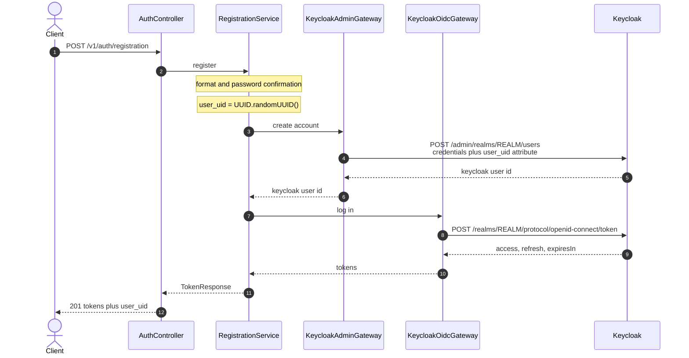
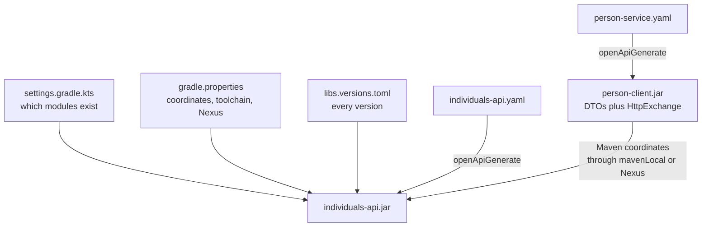
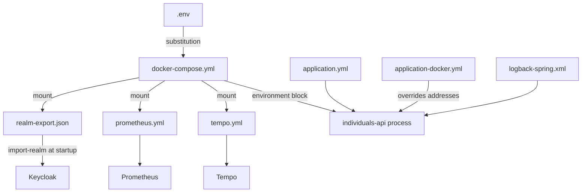

# CONTEXT

Project context for humans and LLMs. Read this first before touching anything.

---

## 1. What this repository is

`payment-platform` — monorepo of the payment platform.
Location on disk: `D:\IDEA_projects\payment-platform`.

Module 1 delivers **individuals-api**: the external entry layer that
orchestrates user registration and authentication. It stores nothing itself.

| Component | Is the source of truth for |
|---|---|
| `person-service` | the domain user, address, individual data |
| Keycloak | the account, tokens, roles, auth attributes |
| `individuals-api` | nothing — it only coordinates the two above |

The root is deliberately named after the platform, not after one service:
`transaction-service`, `payment-service`, `webhook-collector-service` and
`notification-service` land here in later modules.

---

## 2. Fixed technical decisions

These are settled. Do not change them without an explicit decision.

| Decision | Value | Where it lives |
|---|---|---|
| Gradle root project | `payment-platform` | `settings.gradle.kts` |
| Base package | `com.dezxxx.individuals` | — |
| Maven group | `com.dezxxx` | `gradle.properties` |
| Java | 25 (Gradle toolchain, ignores `JAVA_HOME`) | `gradle.properties` |
| Spring Boot | 4.1.0 | `gradle/libs.versions.toml` |
| Gradle | 9.5.1 via Wrapper | `gradle/wrapper/` |
| Lombok | yes — 1.18.46 | root `build.gradle.kts` |
| OpenAPI Generator | 7.14.0 | `gradle/libs.versions.toml` |
| Build tool | Gradle Kotlin DSL only | — |
| Keycloak image | 26.7.2 | `.env` |
| Testcontainers | 2.0.5, inherited from the Boot BOM | artifact ids differ from 1.x — see section 9 |

`JAVA_HOME` on this machine points at JDK 21. That is fine and must not be
"fixed" — the Gradle toolchain provisions JDK 25 on its own. JDK 25 is
installed at `C:\Users\Dez\.jdks\openjdk-25.0.1`.

### Version policy

**No version is ever hardcoded in a build script.** Three layers hold them:

| File | Holds |
|---|---|
| `gradle/libs.versions.toml` | every library, plugin and container tag used by the build |
| `gradle.properties` | coordinates, toolchain, Nexus URLs |
| `.env` | image tags, ports and credentials for docker-compose |

---

## 3. Architectural rules

0. **Reactive stack — Spring WebFlux, not Spring MVC.** Required by the
   handout. Netty instead of Tomcat, `Mono`/`Flux` instead of plain return
   types, `WebClient` instead of `RestClient`, `SecurityWebFilterChain` instead
   of `SecurityFilterChain`. Nothing in the service may block the event loop:
   no `.block()`, no blocking JDBC, no blocking HTTP client. Both OpenAPI
   modules are generated with `reactive = true`, so the contracts themselves
   are `Mono`-typed and a blocking implementation would not even compile
   against them.

1. **Contract first, always.** The OpenAPI spec is written before the code.
   Nothing is hand-written that a generator can produce.
   - `individuals-api/openapi/individuals-api.yaml` — server interfaces are
     generated from it; controllers *implement* them, so the code cannot drift
     from the contract.
   - `person-service/openapi/person-service.yaml` — `person-client` generates
     DTOs and `@HttpExchange` clients from it.

2. **No hand-written DTOs.** Every DTO comes out of a generator.

3. **No `project(":...")` dependencies between modules.** Cross-module
   contracts travel as artifacts published to Nexus, addressed by Maven
   coordinates. Modules are `include`d only so one wrapper builds them all.

4. **Transport = Spring HTTP Service Clients + WebClient.** No Feign.
   `person-client` is generated with `library = spring-http-interface`, and the
   proxies are built with `WebClientAdapter` so every call returns a `Mono`.

5. **Every build validates the contracts** — `openApiValidate` runs before
   `openApiGenerate`, and `check` depends on it. A broken contract fails the
   build, not the runtime.

### individuals-api layers

Mandatory chain, one direction only:

```
controller -> service -> gateway -> external system
```

| Layer | Holds | Never does |
|---|---|---|
| `controller` | accepts and returns DTOs, implements the generated `AuthApi` | business logic; direct calls to Keycloak or person-service |
| `service` | orchestration of the registration and login scenarios | HTTP, JSON, Keycloak or person-client types |
| `gateway` | every outbound call, one gateway per external system | domain decisions |
| `validation`, `error`, `config`, `metrics` | validation rules, error mapping, security wiring, meters | anything belonging to another layer |

Three gateways, no exceptions:

- `PersonServiceGateway` — wraps the generated `PersonsApi`
- `KeycloakAdminGateway` — account creation, password, attributes
- `KeycloakOidcGateway` — token endpoint: login and refresh

**Identifiers.** The business layer knows only the domain `user_uid`. The
Keycloak `sub` is stored as a technical link (`keycloak_user_id`) and never
becomes the platform's primary identifier. Nothing above the gateway layer is
allowed to address a user by it.

**Why gateways rather than repositories.** individuals-api owns no data, so it
has no repository. The gateway takes that seat in the layer chain: an
interface out front, an implementation behind it, injected into the service
through the constructor as a reference type. The rule that Service and
Controller never get invented interfaces of their own still holds.

Patterns in play: `PersonServiceGateway` is an **Adapter** - it translates the
generated client's types into domain types so generated code never leaks
upwards. `KeycloakAdminGateway` is a **Facade** - one method hides the three
Admin API calls that create an account, set its password and write the
`user_uid` attribute.

### Compensation policy

The order - domain user first, Keycloak account second - guarantees no Keycloak
account is ever left without a domain user. The inverse case is real: if the
Keycloak steps fail, the domain user already exists in person-service.

When that happens the service must:

- write a structured error,
- mark the incident as an inconsistent registration,
- return an error to the client,
- never hide the partial failure.

Module 1 uses the simplified form: logging plus an explicit error code. Real
compensating transactions come later in the course. Nothing here silently
retries or pretends the registration succeeded.

### Observability

**Metrics.** Actuator plus Prometheus. Only `health` is exposed over HTTP by
default, so the Prometheus endpoint is turned on explicitly:

```yaml
management:
  endpoints:
    web:
      exposure:
        include: "health,info,prometheus"
  endpoint:
    health:
      probes:
        enabled: true
```

`prometheus.yml` must point at `metrics_path: /actuator/prometheus`.

Required application meters:

| Meter | Type | Meaning |
|---|---|---|
| `auth.registration` | counter | registration attempts |
| `auth.registration.success` | counter | successful registrations |
| `auth.registration.failure` | counter | failed registrations |
| `auth.login` | counter | logins |
| `auth.login.failure` | counter | failed logins |
| `auth.refresh` | counter | token refreshes |
| `external.keycloak.requests` | timer | Keycloak call duration |
| `external.person_service.requests` | timer | person-service call duration |

Named in Micrometer's dotted convention, **not** with the `_total` suffix the
handout table shows. Prometheus appends `_total` to counters itself, so a meter
registered as `auth_registration_total` is scraped as
`auth_registration_total_total`. The handout lists the scraped names; the code
must register the dotted ones.

**Tracing.** Micrometer Tracing over OpenTelemetry, exported by OTLP:

```yaml
management:
  tracing:
    sampling:
      probability: 1.0
  opentelemetry:
    tracing:
      export:
        otlp:
          endpoint: http://tempo:4318/v1/traces
```

The `management.opentelemetry.tracing.export.otlp.*` namespace is the Boot 4
one - Boot 3 used `management.otlp.tracing.*`. Trace context propagates across
the network only when the HTTP client is built from Spring's autoconfigured
builders, which is another reason the gateways must not construct their own.

**Logs.** JSON to stdout, every record carrying: service name, `traceId`,
`spanId`, request path, HTTP method, response status, business error code, and
the domain `user_uid` when known.

### Keycloak realm

`realm/realm-export.json` must define:

- a realm of its own for the course
- a confidential client for individuals-api
- a service account on that client for the Admin REST API
- a mapper putting `user_uid` into the token, or a consistent way to read it
  through `/me`
- the roles needed to read and manage users (`view-users`, `manage-users` from
  `realm-management`)
- `upConfig` declaring `user_uid` as a user profile attribute — see below

The client secret is a credential: it lives in `.env`, never in the export
committed to git.

#### Why `upConfig` is not optional

Since Keycloak 24 the declarative user profile is always on, and unmanaged
attributes are **disabled** by default. An attribute that the profile does not
declare is dropped silently: `POST /admin/realms/{realm}/users` still answers
`201`, the account is created, and the attribute is simply not there. No error,
no warning. The protocol mapper then has nothing to map and the claim never
appears in the token.

That is exactly what happened here, and it was invisible until a token was
decoded. The fix is to declare `user_uid` in `upConfig`. Declaring `upConfig`
replaces the whole default profile, so `username`, `email`, `firstName` and
`lastName` have to be listed again with their original validations.

Editing the user profile needs `manage-realm`, which our service account
deliberately does **not** have — it is configuration, not runtime work, so it
belongs in `realm-export.json` and nowhere else.

#### Verified against a running Keycloak 26.7.2

Checked end to end after a `down -v` and a fresh import:

| Check | Result |
|---|---|
| `client_credentials` on `individuals-api` | token issued — client is confidential, secret matches `.env`, service account is on |
| `GET /admin/realms/{realm}/users` with that token | `200` — `view-users` really is granted |
| create user with `credentials` + `attributes` in one call | `201`, account complete |
| password grant as that user | tokens issued, and `user_uid` present as a claim |
| same, but `"temporary": true` | `400 invalid_grant`, `Account is not fully set up` |
| create a second user with an existing email | `409`, `User exists with same email` |
| password grant with a wrong password | `400 invalid_grant`, `Invalid user credentials` |

Two consequences for the gateway code:

- Keycloak answers a bad password with **400**, not 401. `KeycloakOidcGateway`
  translates it: our contract says 401, and the client must never see 400 here.
- `400 invalid_grant` covers both a wrong password and a not-fully-set-up
  account. The status code alone cannot tell them apart — only
  `error_description` can. Log the description, return 401.

### Deviations from the course handout, and why

| Handout | Here | Reason |
|---|---|---|
| `generatorName("java")` | `"spring"` + `library("spring-http-interface")` | the same handout mandates Spring HTTP Service Clients, not a generic Java client |
| `$buildDir` | `layout.buildDirectory` | `$buildDir` was removed in Gradle 9 — the handout snippet does not compile here |
| spec kept in `common/` | spec kept in the module that owns it | matches the artifact table: `person-service/openapi/person-service.yaml` |
| Spring Boot 4.0.6 | 4.1.0 | 4.1.0 reached GA after the handout was written |
| `proselyte` / `com.example` | `dezxxx` / `com.dezxxx` | handout placeholders |
| Tempo traces under `/tmp/tempo/traces` | `/var/tempo`, with an explicit wal path | that is where docker-compose mounts the named volume; under `/tmp` the traces die with the container and the volume stays empty |
| postgres volume at `/var/lib/postgresql/data` | `/var/lib/postgresql` | PostgreSQL 18 moved the data directory one level down and refuses to start when the old path is mounted — the container exits with code 1 |

---

## 4. Registration flow (the core scenario)

**Module 1 talks to Keycloak only.** The handout describes registration as two
consecutive Keycloak calls - create the account, then take tokens for it - and
says nothing about person-service, which does not exist yet. So the domain user
is not created in this module and `user_uid` is issued here.

1. `individuals-api` accepts the registration request
2. validates format and password confirmation
3. generates `user_uid` as a fresh `UUID`
4. obtains a service-account token (`client_credentials`)
5. `POST /admin/realms/{realm}/users` — creates the account in a single call,
   password and `user_uid` attribute in the same body
6. logs in via `/realms/{realm}/protocol/openid-connect/token` (`password`)
7. returns access token, refresh token, lifetime and `user_uid`

Only step 3 changes in module 2: instead of generating the identifier, the
service asks person-service to create the domain user and returns its
`user_uid`. `KeycloakAdminGateway` and `KeycloakOidcGateway` are untouched by
that change - which is exactly why the gateway layer exists.

Step 6 carries the password and the attribute in the same body, so the account
is either created complete or not created at all:

```json
{
  "username": "user@example.com",
  "email": "user@example.com",
  "firstName": "...",
  "lastName": "...",
  "enabled": true,
  "emailVerified": true,
  "attributes": { "user_uid": ["<uuid generated by individuals-api>"] },
  "credentials": [
    { "type": "password", "value": "<password>", "temporary": false }
  ]
}
```

`temporary: false` is mandatory. A temporary password makes Keycloak attach the
`UPDATE_PASSWORD` required action, and step 7 then fails with
`400 invalid_grant: Account is not fully set up`.

The separate `PUT /admin/realms/{realm}/users/{id}/reset-password` call is not
used during registration. It stays available for a future change-password
scenario, and it takes the same `temporary` flag.



**Compensation does not apply in module 1.** Nothing exists outside Keycloak
yet, so a failure leaves nothing orphaned: either the account was created or it
was not. The policy in section 3 becomes live in module 2, when the domain user
is created first and the Keycloak steps can fail behind it.

---

## 5. External API

| Method | Path | Auth |
|---|---|---|
| POST | `/v1/auth/registration` | none |
| POST | `/v1/auth/login` | none |
| POST | `/v1/auth/refresh-token` | none |
| GET | `/v1/auth/me` | Bearer |

### What each endpoint does

**`POST /registration`** — creates the domain user, then the Keycloak account,
then logs in on the caller's behalf so the client never has to send a second
request. Answers `201` with `TokenResponse`. A duplicate email is a `409`, and
it can be raised by either side: `person-service` may already hold that email,
and Keycloak answers `User exists with same email` with its own `409`. Both map
to the same `409` outward — the client does not care which store objected.

**`POST /login`** — no database of ours is touched. Email and password go
straight to Keycloak as `grant_type=password`; on success `200` with
`TokenResponse`. Bad credentials come back from Keycloak as `400 invalid_grant`
and are translated to `401`.

**`POST /refresh-token`** — a thin wrapper over `grant_type=refresh_token`.
Keycloak normally rotates the refresh token too, so both tokens in the response
are fresh. `200` on success; an expired or revoked token is `401`.

**`GET /auth/me`** — protected. Spring Security validates the JWT against the
realm's JWKS, then the service reads `sub` from it and calls
`GET /admin/realms/{realm}/users/{id}` through `KeycloakAdminGateway`.

The call to Keycloak is deliberate, not laziness about parsing the token. A JWT
is a snapshot from the moment it was issued and stays valid for its lifetime, so
a token alone cannot tell us whether the account was disabled or deleted a
minute ago; the Admin API can. It also carries fields the token does not, such
as the creation timestamp. If the account is gone, `/me` answers `404`; if the
token itself is bad or expired, `401`.

The roles in `CurrentUserResponse` are read from the token's `realm_access`, not
from a second Admin API call — they are already there and cost nothing.

> Open point: the handout's `/me` description mentions the registration
> timestamp, which `CurrentUserResponse` does not currently declare. Adding it
> means touching the frozen contract, so it waits for a decision.

### Port map

Host ports, as fixed by the course handout. Values live in `.env`, never in
`docker-compose.yml`.

| Service | Host | Container |
|---|---|---|
| keycloak | 8080 | 8080 |
| individuals-api | 8081 | 8081 |
| keycloak-postgres | 5433 | 5432 |
| person-postgres | 5434 | 5432 |
| prometheus | 9090 | 9090 |
| tempo | 3200, 4318 | 3200, 4318 |
| loki | 3100 | 3100 |
| alloy | - | - |
| grafana | 3000 | 3000 |

`person-service` gets 8082 in module 2 - not from the handout, chosen because
8081 is taken. The OpenAPI `servers` entries follow this table.

**Nexus runs on 8083, not on its own default 8081.** The handout fixes 8081 for
individuals-api, so Nexus is the one that has to move; the URLs live in
`gradle.properties`. Until Nexus is up, that unreachable repository is also why
IntelliJ reports `Sources were not downloaded for ...`: an ordinary build finds
the jar in Maven Central and never reaches the third repository, but the IDE
asks every repository for sources and reports the whole lookup as failed.

---

## 6. Module layout

```
payment-platform/
├── settings.gradle.kts        includes modules, Nexus + mavenLocal resolution
├── build.gradle.kts           shared conventions (toolchain, Lombok, tests)
├── gradle.properties          coordinates, toolchain, Nexus
├── gradle/libs.versions.toml  every version
├── docker-compose.yml
├── .env                       image tags, ports, credentials (not in git)
├── infra/                     prometheus, tempo, grafana provisioning
├── postman/
├── docs/                      PlantUML diagrams (component, deployment,
│                              registration sequence, layers)
├── person-client/             generated DTOs + HTTP clients -> Nexus
├── individuals-api/           the orchestrator
└── person-service/            contract + Flyway migrations only (module 2)
```

---

## 7. Build order

`person-client` must exist as an artifact before `individuals-api` resolves.
Until Nexus is up, `mavenLocal()` covers it:

```bash
./gradlew :person-client:publishToMavenLocal
./gradlew build
```

---

## 8. Progress — module 1

### Acceptance criteria

The module is accepted only when every line below is true. These are the
handout's, verbatim in meaning.

| # | Criterion |
|---|---|
| 1 | the monorepo contains individuals-api and person-service |
| 2 | the OpenAPI contracts exist and pass `openApiValidate` |
| 3 | registration works through the orchestration scenario |
| 4 | `user_uid` is written into Keycloak as a user attribute |
| 5 | `/login`, `/refresh-token` and `/me` work |
| 6 | the HTTP client with its DTOs is published to Nexus |
| 7 | `docker compose up --build` brings up the infrastructure and the app |
| 8 | `/actuator/health` and `/actuator/prometheus` are reachable |
| 9 | traces are visible in Grafana/Tempo |
| 10 | unit and integration tests exist |
| 11 | the main scenario is covered at 80% or better on the key services |
| 12 | README.md and CONTEXT.md are written |

Criterion 11 needs a coverage tool, and the build has none yet - JaCoCo is on
the list below.

### Mandatory test cases

**Unit** - orchestration, validation, error mapping, conflicts, parsing the
answers of external systems.

| Code | Scenario | Expected |
|---|---|---|
| UT-REG-001 | valid registration request | person-service is called first, then Keycloak, then tokens are returned |
| UT-REG-002 | password and confirmation differ | 400, Keycloak is never called |
| UT-REG-003 | person-service reports an email conflict | 409, Keycloak is never called |
| UT-REG-004 | domain user created, Keycloak unreachable | 502/503, the partial failure is recorded |
| UT-LOG-001 | successful login | access and refresh tokens returned |
| UT-LOG-002 | wrong password | 401 |
| UT-REF-001 | successful token refresh | a new access token is returned |
| UT-ME-001 | valid bearer token | the current user is returned |

**Integration** - containers, real HTTP against Keycloak, tokens, actuator,
tracing.

| Code | Scenario | Expected |
|---|---|---|
| IT-KC-001 | registration against a real Keycloak container | the user appears in the realm |
| IT-KC-002 | after registration | the `user_uid` attribute is found in Keycloak |
| IT-KC-003 | `/login` against the real token endpoint | a real JWT comes back |
| IT-OBS-001 | `/actuator/prometheus` | Prometheus metrics are readable |
| IT-OBS-002 | after a request | a trace is visible in Tempo/Grafana |
| IT-OBS-003 | log records | carry `traceId` and `spanId` |
| IT-DB-001 | person-service migrations against PostgreSQL | Flyway succeeds |

**Where these classes must live.** `individuals-api/build.gradle.kts` filters
`test` to `com.dezxxx.individuals.unit.*` and `integrationTest` to
`com.dezxxx.individuals.integration.*`. A test placed anywhere else runs in
neither task and fails silently by never running at all.

### Done

- [x] Monorepo root `payment-platform`, git on `main`
- [x] Directory skeleton for all modules
- [x] `.gitignore`
- [x] `gradle/libs.versions.toml` — every version extracted
- [x] `gradle.properties` — coordinates, toolchain, Nexus
- [x] `settings.gradle.kts` — modules, Nexus + mavenLocal, placeholders for the
      next course modules
- [x] Root `build.gradle.kts` — toolchain 25, Lombok, test conventions
- [x] Gradle Wrapper 9.5.1
- [x] `person-client/build.gradle.kts` — generate + publish to Nexus
- [x] `individuals-api/build.gradle.kts` — Boot app, contract-first, split
      unit / integration test tasks
- [x] `person-service/build.gradle.kts` — contract validation only
- [x] `individuals-api/openapi/individuals-api.yaml` — 4 endpoints, shared
      error model, payload examples on every external method
- [x] `person-service/openapi/person-service.yaml` — the 3 frozen operations,
      schemas mirroring the DDL, same shared error model
- [x] Flyway `V001__init_person_schema.sql`
- [x] Flyway `V002__seed_countries.sql` — all 249 ISO 3166-1 entries
- [x] `.env` + `.env.example` + `docker-compose.yml` — images pinned, ports per
      the handout table
- [x] **First real `./gradlew build` — green.** See section 9.

### Next up, in this order

- [ ] `application.yml` / `application-docker.yml` / `logback-spring.xml`
- [ ] `realm/realm-export.json`
- [ ] `individuals-api/Dockerfile`
- [ ] `infra/` — prometheus, tempo, grafana provisioning
- [ ] `README.md`
- [ ] Postman collection
- [ ] Business code: controller / service / gateway / keycloak / error
- [ ] Unit tests, then Testcontainers integration tests
- [ ] JaCoCo — acceptance criterion 11 asks for a coverage number and the
      build cannot produce one yet
- [ ] Publish `person-client` to Nexus — acceptance criterion 6; only
      `publishToMavenLocal` has been exercised so far

### Working agreements

- No commit or push without explicit approval, every time.
- Commit author is always `Sergey Zatulsky <web7tudio@gmail.com>`.
- Commit messages in English, `type: short description`.
- Communication in Russian, code and comments in English.
---

## 9. First build run — what it cost

`./gradlew build` had never been executed before 2026-08-19. Versions had been
checked against Maven Central by hand, but nothing had been resolved for real.
Seven defects surfaced; all are fixed and the build is green from `clean`.

| # | Symptom | Root cause | Fix |
|---|---|---|---|
| 1 | Wrapper could not download the distribution, `Connect timed out` after 10 s | `services.gradle.org` redirects to GitHub release assets; `networkTimeout=10000` with `retries=0` gave up on the first slow connect | `networkTimeout=120000`, `retries=3`, `retryBackOffMs=2000` |
| 2 | `Could not resolve com.dezxxx:person-client` → `Username must not be null!` | the `credentials { }` block was declared unconditionally; Gradle treats null credentials as a hard error, not as an unreachable repository, and aborts the whole resolution | credentials attached only when `NEXUS_USERNAME` **and** `NEXUS_PASSWORD` are set — in `settings.gradle.kts` and in the `person-client` publish repo |
| 3 | `Configuration cache state could not be cached` | downstream of #2 — an unresolvable classpath cannot be serialised | disappeared with #2 |
| 4 | `sourcesJar` used the output of `openApiGenerate` without declaring a dependency | the generated directory was added to `sourceSets` as a bare path, so only the hand-wired `compileJava` knew about it | the srcDir is now wired to the task provider, so every consumer inherits the dependency |
| 5 | `TemplateNotFoundException: pom-sb3.mustache` | the generator tried to emit a Maven `pom.xml` as a supporting file; the `spring-http-interface` library ships no such template | `globalProperties = { apis, models }` — APIs and models only, no supporting files |
| 6 | `package org.springframework.format.annotation does not exist` | generated models annotate date-time properties with `@DateTimeFormat`, which lives in `spring-context`, not `spring-web` | `spring-context` added to the catalog and to `person-client` |
| 7 | `Could not find org.testcontainers:junit-jupiter:` (empty version) | Boot 4.1 imports **Testcontainers 2.0.5**, and 2.x renamed every module artifact | `testcontainers-junit-jupiter`, `testcontainers-postgresql` |

Two more things the run settled:

- `val integrationTest by tasks.registering(...)` is deprecated as of Gradle 9.6
  and would not survive Gradle 10. Rewritten as
  `tasks.register<Test>("integrationTest")`. The build now reports no
  deprecations at all.
- `bootJar` failed with *"Main class name has not been configured"* — expected,
  since no application class existed yet. `IndividualsApiApplication` was added.

### Verified, not assumed

- Gradle 9.5.1 runs the whole build; 9.7.1 was verified to exist and work too,
  but is held back by the IDE — see "Why Gradle 9.5.1" below.
- Spring Boot 4.1.0, OpenAPI Generator 7.14.0, Lombok 1.18.46 all resolve.
- `person-client` generates `PersonsApi` with `@HttpExchange` — Spring HTTP
  Service Clients, no Feign, as rule 4 requires.
- `individuals-api` generates `AuthApi` as an interface only.
- All three specs pass `openApiValidate`.
- `clean build` takes ~6 s and produces `individuals-api.jar`.

### Known noise, not defects

- ~100 deprecation warnings from generated sources: OpenAPI Generator 7.14.0
  emits `org.springframework.lang.@Nullable`, deprecated in Spring 7. Harmless;
  worth silencing on the generated source set rather than in the generator.
- `Ignoring complex example on request body` — the generator does not carry
  multi-example blocks into code. The examples stay in the contract, which is
  where the handout wants them.

### Contract alignment with the handout

`ErrorResponse` now matches the model the handout fixes for the whole course:
`required` is `[timestamp, path, status, error, message, traceId]`, and
`details` is an **array of strings**. The earlier `ErrorDetail` object carried
more structure, but five services will share this model — consistency wins.
Field information survives as `"confirmPassword: must match password"`.

`UserResponse` was renamed to `CurrentUserResponse` to match the handout's
required schema list.

### Why Gradle 9.5.1 and not the latest

The wrapper was originally pinned to 9.7.1, which is the current Gradle
release. The build works on it. IntelliJ IDEA 2025.2.6 does not: its Kotlin
plugin loads the script *templates* from the Gradle distribution but never
produces the per-script model, so every `build.gradle.kts` shows as fully
unresolved in the editor — down to `mapOf` and `to` from the Kotlin standard
library — while `./gradlew build` stays green.

The fingerprint that identified it: the **Java** module model synced correctly
(JDK 25 detected, Spring imports resolved, zero errors in `.java` files) while
**every** `.kts` was red. A build defect cannot break the Kotlin stdlib in one
file type only.

Ruled out along the way, both wrong:

- the build scripts themselves — `./gradlew projects` succeeds, which requires
  Gradle to compile every build script first;
- `org.gradle.configuration-cache` — disabling it changed nothing, and the IDE
  log showed the script definitions loading fine. It is back on.

Confirmed by dropping the wrapper to 9.5.1 and re-syncing: the editor went
clean immediately, with no change to any build file.

Revisit when IDEA ships support for Gradle 9.7. Moving back is one line in
`gradle/wrapper/gradle-wrapper.properties` — nothing in the build depends on
the version.

---

## 10. Configuration map

The same four views exist as PlantUML in `docs/` - `component.puml`,
`deployment.puml`, `registration-sequence.puml` and `layers.puml` - for the
IDE plugin. The Mermaid below is the copy that renders on GitHub without one.
When one changes, change the other.

The files here work at two different times and mostly do not know about each
other. What binds them is a handful of values that must agree - and those are
exactly the places that break silently.

### Build time - no containers exist yet



The OpenAPI specs live only here. At runtime nothing reads them - the code was
already generated from them.

### Run time - who reads what



`.env` is substituted into the compose file itself. It does **not** reach the
container - only the `environment:` block does. That is why individuals-api
lists `KEYCLOAK_REALM`, `KEYCLOAK_CLIENT_ID` and `KEYCLOAK_CLIENT_SECRET`
explicitly.

### Run time - who talks to whom


Two opposite mechanics, and they are easy to confuse. **Prometheus pulls** -
it walks to the application on a schedule, so the application's address lives
in `prometheus.yml`. **The application pushes** traces, so Tempo's address
lives in `application.yml`. One arrow points each way.

### Values that must agree

Every row is a place where a mismatch breaks something without raising an
error anywhere.

| Coupling | One side | Other side | What must match |
|---|---|---|---|
| metrics scrape | `prometheus.yml` target `individuals-api:8081` | compose service name plus `server.port` | name and port |
| metrics path | `prometheus.yml` `metrics_path` | `application.yml` `exposure.include` | prometheus is exposed |
| traces | `application-docker.yml` `tempo:4318/v1/traces` | `tempo.yml` OTLP http receiver | host, port, path |
| Tempo storage | `tempo.yml` `/var/tempo/...` | compose `tempo-data:/var/tempo` | the path |
| realm name | `.env` `KEYCLOAK_REALM` | `realm-export.json` `realm` | the value |
| client id | `.env` `KEYCLOAK_CLIENT_ID` | `realm-export.json` `clientId` | the value |
| client secret | `.env` `KEYCLOAK_CLIENT_SECRET` | `realm-export.json` `secret` | the value |
| app port | `application.yml` `server.port` | compose `8081:8081` | the right-hand side |

How this bites: change `server.port` to 8080 and forget `prometheus.yml`. The
application starts, `/actuator/prometheus` answers, and Prometheus quietly
scrapes a refused connection. No error in the application log - just an empty
graph in Grafana.
