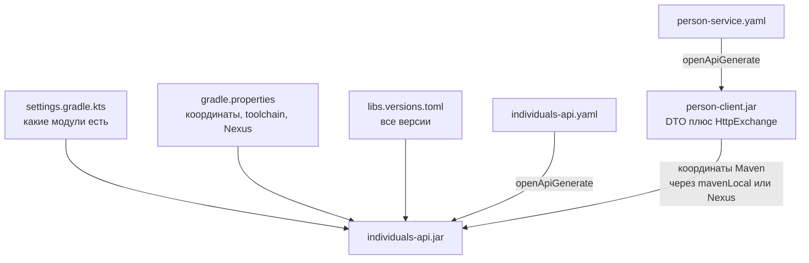
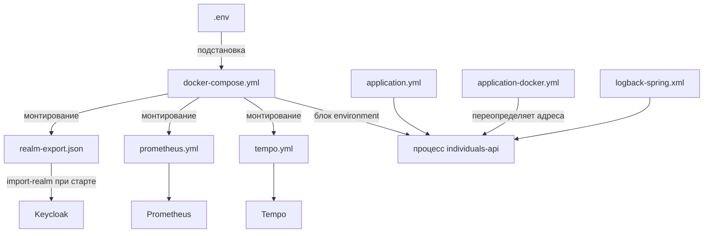
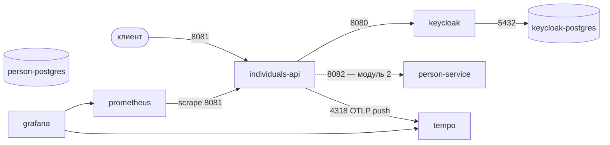

# CONTEXT (русская версия)

Контекст проекта для людей и для LLM. Прочитать до того, как что-то трогать.

> Это перевод `CONTEXT.md`. Английская версия — основная: когда что-то меняется,
> правятся **оба** файла. Если тексты разошлись — прав английский.

---

## 1. Что это за репозиторий

`payment-platform` — монорепозиторий платёжной платформы.

Модуль 1 сдаёт **individuals-api**: внешний входной слой, который оркестрирует
регистрацию и аутентификацию пользователей. Сам он не хранит ничего.

| Компонент | Источник правды для |
|---|---|
| `person-service` | доменного пользователя, адреса, данных физлица |
| Keycloak | учётной записи, токенов, ролей, атрибутов аутентификации |
| `individuals-api` | ничего — только координирует двух выше |

**Где значение лежит — не значит, кому принадлежит правда о нём.** Одно и то же
имя есть и в person-service, и в учётной записи Keycloak, но источник только
один: в учётке лежит копия, записанная один раз при регистрации, и дальше её
никто не синхронизирует. Прочитать доменное поле из Keycloak просто потому, что
оно там оказалось, — самый лёгкий способ потерять эту границу. Где именно
модуль 1 так и делает и почему — см. `/me` в разделе 5.

Корень назван по платформе, а не по одному сервису, намеренно:
`transaction-service`, `payment-service`, `webhook-collector-service` и
`notification-service` приедут сюда в следующих модулях.


### Вся платформа, для будущих модулей

Записано с описания полной системы из курса, чтобы следующие модули от неё не
разъехались. Сегодня существуют только первые две строки.

| Сервис | Тип | Владеет | С кем говорит |
|---|---|---|---|
| **Individuals API** | оркестратор | ничем, базы нет | Keycloak (Admin + Token API), все доменные сервисы |
| **Keycloak** | внешний IAM | учётными данными, ролями, выдачей и проверкой JWT | — |
| **Users Service** | доменный | бизнес-профилем: имя, страна, адрес | вызывается только через Individuals API |
| **Wallets Service** | доменный | кошельками и балансами, внутренними переводами | потребитель Kafka |
| **Payments Service** | доменный | транзакциями пополнения, перевода, вывода | Currency Service, Fake Payment Provider, Kafka |
| **Currency Service** | утилитарный | курсами валют от внешнего провайдера | вызывается Payments Service |
| **Webhook Service** | интеграционный | входящими вебхуками от провайдера | публикует в Kafka, сам ничего не обрабатывает |
| **Notification Service** | инфраструктурный | уведомлениями пользователя + REST для их чтения | потребитель Kafka |
| **Fake Payment Provider** | внешняя заглушка | имитирует платёжный шлюз, отвечает вебхуком | — |

Поведение, которое описание фиксирует, и которое следующие модули не имеют
права придумать иначе:

- **Балансы меняются только по событиям Kafka** (`transaction.completed`,
  `transaction.failed`). Wallets Service никогда не правит баланс по REST-вызову.
- **`/init` ничего не пишет в базу.** Платёжная транзакция сохраняется только
  после успешного `/confirm`.
- **Эндпоинт вебхука защищён общим секретом**, проверяется на каждом вызове.
- **Webhook Service только публикует** `payment.status.updated`; что это значит,
  решают потребители.
- Notification Service реагирует на события вида `user.registered` и
  `transaction.completed`.

Два стиля интеграции сосуществуют намеренно: синхронный REST там, где ответ
нужен сейчас, Kafka там, где работа может завершиться позже. Компенсация
существует из-за первого стиля — см. «Политика компенсации» ниже.

#### Именование: `person-service` или `users-service`

Задание модуля 1 называет доменный сервис `person-service`, и репозиторий
следует ему: Gradle-модуль, контракт, публикуемый артефакт `person-client`,
схема БД `person` и свойства `individuals.person-service.*` — всё под этим
именем. Описание платформы выше называет тот же сервис **Users Service**.

Считаем это одним сервисом под двумя именами, пока курс не скажет иначе. Если
следующий модуль потребует второе имя, переименование затронет:
`settings.gradle.kts`, каталог модуля,
`person-service/openapi/person-service.yaml`, координаты публикуемого артефакта,
`PersonsApi`, схему Flyway, compose-сервис `person-postgres` и
`PersonServiceProperties`. Изменение механическое, но не маленькое — поэтому
спекулятивно не делается.

---

## 2. Зафиксированные технические решения

Это решено. Не менять без явного решения.

| Решение | Значение | Где живёт |
|---|---|---|
| Корневой проект Gradle | `payment-platform` | `settings.gradle.kts` |
| Базовый пакет | `com.dezxxx.individuals` | — |
| Maven group | `com.dezxxx` | `gradle.properties` |
| Java | 25 (Gradle toolchain, игнорирует `JAVA_HOME`) | `gradle.properties` |
| Spring Boot | 4.1.0 | `gradle/libs.versions.toml` |
| Gradle | 9.5.1 через Wrapper | `gradle/wrapper/` |
| Lombok | да — 1.18.46 | корневой `build.gradle.kts` |
| OpenAPI Generator | 7.14.0 | `gradle/libs.versions.toml` |
| Инструмент сборки | только Gradle Kotlin DSL | — |
| Образ Keycloak | 26.7.2 | `.env` |
| Testcontainers | 2.0.5, из Boot BOM | id артефактов отличаются от 1.x — см. раздел 9 |

Gradle toolchain сам подтягивает JDK 25, поэтому на что указывает `JAVA_HOME`
для сборки неважно — и «чинить» его, чтобы заработало, не надо.

### Политика версий

**Ни одна версия никогда не пишется прямо в build-скрипт.** Их держат три слоя:

| Файл | Держит |
|---|---|
| `gradle/libs.versions.toml` | все библиотеки, плагины и теги контейнеров сборки |
| `gradle.properties` | координаты, toolchain, URL Nexus |
| `.env` | теги образов, порты и учётные данные для docker-compose |

---

## 3. Архитектурные правила

0. **Реактивный стек — Spring WebFlux, не Spring MVC.** Требование задания.
   Netty вместо Tomcat, `Mono`/`Flux` вместо обычных типов возврата,
   `WebClient` вместо `RestClient`, `SecurityWebFilterChain` вместо
   `SecurityFilterChain`. Ничто в сервисе не имеет права блокировать event loop:
   никаких `.block()`, никакого блокирующего JDBC, никакого блокирующего
   HTTP-клиента. Оба OpenAPI-модуля генерируются с `reactive = true`, так что
   сами контракты типизированы через `Mono`, и блокирующая реализация просто не
   скомпилируется против них.

1. **Сначала контракт, всегда.** Спецификация OpenAPI пишется до кода. Руками
   не пишется ничего, что может выдать генератор.
   - `individuals-api/openapi/individuals-api.yaml` — из него генерируются
     серверные интерфейсы; контроллеры их *реализуют*, поэтому код не может
     разъехаться с контрактом.
   - `person-service/openapi/person-service.yaml` — из него `person-client`
     генерирует DTO и `@HttpExchange`-клиенты.

2. **Никаких рукописных DTO.** Каждый DTO выходит из генератора.

3. **Никаких зависимостей `project(":...")` между модулями.** Межмодульные
   контракты ездят артефактами, опубликованными в Nexus, по Maven-координатам.
   Модули `include`-ятся только чтобы один wrapper собирал их все.

4. **Транспорт = Spring HTTP Service Clients + WebClient.** Ни Feign, ни
   `RestClient`. `person-client` генерируется с
   `library = spring-http-interface`, прокси строятся через `WebClientAdapter`,
   так что каждый вызов возвращает `Mono`. Задание называет `RestClient`;
   почему адаптер отличается, а стиль — нет, см. таблицу отклонений.

5. **Каждая сборка валидирует контракты** — `openApiValidate` идёт перед
   `openApiGenerate`, и `check` от него зависит. Сломанный контракт валит
   сборку, а не рантайм.

6. **Правила запроса объявляются в контракте, а не пишутся руками.** В сборке
   стоит `useBeanValidation = true`, поэтому `@NotNull`, `@Size`, `@Email` и
   остальное генерируются прямо из ключевых слов схемы, и их никто не
   поддерживает. В OpenAPI нет способа сказать «это поле равно тому», и это
   важно ровно в одном месте: правило подтверждения пароля написано как
   ограничение уровня класса в `validation` и прицеплено к сгенерированной
   модели через `x-class-extra-annotation` в схеме. Правило по-прежнему живёт в
   контракте — в Java только его тело — и применяется тем же `@Valid`, что и
   всё остальное, без вызова, который контроллер обязан не забыть сделать.
   Выше запрос повторно никто не валидирует.

   **Язык сообщения валидации отдан машине.** Сгенерированные ограничения
   отвечают из словарей самого Hibernate Validator, а словарь выбирается по
   локали JVM — поэтому на русской Windows сервис отвечает по-русски, а внутри
   контейнера по-английски; наше собственное `must match password` захардкожено
   и остаётся английским в любом случае, так что один массив `details` может
   нести оба языка. Для модуля 1 это осознанно: развёртывание одно, локальная
   машина, и правила на ней устанавливает её владелец. Зафиксировать язык позже
   — это бин: интерполятор сообщений с прибитой локалью либо читающий
   `Accept-Language` запроса, если понадобится настоящая локализация. Остальной
   код при этом не двигается.

### Слои individuals-api

Обязательная цепочка, только в одну сторону:

```
rest -> service -> gateway -> внешняя система
```

Первый пакет называется `rest`, а не `controller`: этот сервис говорит только
по REST — ни слоя представлений, ни серверных страниц, ни консьюмеров, — поэтому
пакет назван по протоколу, который он обслуживает, а не по спринговому
стереотипу внутри него. Имя `api` было недоступно, оно принадлежит
сгенерированному коду.

| Слой | Держит | Никогда не делает |
|---|---|---|
| `rest` | принимает и возвращает DTO, реализует сгенерированный `AuthApi` | бизнес-логику; прямые вызовы Keycloak или person-service |
| `service` | оркестрацию сценариев регистрации и входа | HTTP, JSON, типы Keycloak или person-client |
| `gateway` | все исходящие вызовы, один шлюз на внешнюю систему | доменные решения |
| `validation`, `error`, `config`, `metrics` | правила валидации, маппинг ошибок, обвязку безопасности, метрики | всё, что принадлежит другому слою |

Три шлюза, без исключений:

- `PersonServiceGateway` — оборачивает сгенерированный `PersonsApi`
- `KeycloakAdminGateway` — создание аккаунта, пароль, атрибуты
- `KeycloakOidcGateway` — token endpoint: логин и обновление

**Идентификаторы.** Бизнес-слой знает только доменный `user_uid`. Keycloak-овский
`sub` хранится как техническая связка (`keycloak_user_id`) и никогда не
становится главным идентификатором платформы. Ничему выше слоя шлюзов не
разрешено адресовать пользователя по нему.

**Почему шлюзы, а не репозитории.** individuals-api не владеет данными, значит
репозитория у него нет. Шлюз занимает его место в цепочке слоёв: интерфейс
снаружи, реализация за ним, внедряется в сервис через конструктор ссылочным
типом. Правило «Service и Controller не получают выдуманных интерфейсов»
продолжает действовать.

Паттерны в деле: `PersonServiceGateway` — **Adapter**, переводит типы
сгенерированного клиента в доменные, чтобы сгенерированный код не протекал
наверх. `KeycloakAdminGateway` — **Facade**, прячет несколько вызовов Admin API
за понятными методами.

### Политика компенсации

Порядок — сначала доменный пользователь, потом аккаунт в Keycloak —
гарантирует, что аккаунт Keycloak никогда не останется без доменного
пользователя. Обратный случай реален: если шаги Keycloak упали, доменный
пользователь в person-service уже создан.

Когда это происходит, сервис обязан:

- записать структурированную ошибку,
- пометить инцидент как несогласованную регистрацию,
- вернуть клиенту ошибку,
- никогда не скрывать частичный сбой.

Модуль 1 использует упрощённую форму: логирование плюс явный код ошибки
(`REGISTRATION_INCONSISTENT`). Настоящие компенсирующие транзакции — дальше по
курсу. Ничто здесь не делает молчаливых повторов и не притворяется, что
регистрация удалась.

### Наблюдаемость

**Метрики.** Actuator плюс Prometheus. По умолчанию наружу отдаётся только
`health`, поэтому эндпоинт Prometheus включается явно:

```yaml
management:
  endpoints:
    web:
      exposure:
        include: "health,info,prometheus"
  endpoint:
    health:
      probes:
        enabled: true
```

`prometheus.yml` обязан указывать на `metrics_path: /actuator/prometheus`.

Обязательные метрики приложения:

| Метрика | Тип | Смысл |
|---|---|---|
| `auth.registration` | counter | попытки регистрации |
| `auth.registration.success` | counter | успешные регистрации |
| `auth.registration.failure` | counter | неуспешные регистрации |
| `auth.login` | counter | входы |
| `auth.login.failure` | counter | неуспешные входы |
| `auth.refresh` | counter | обновления токена |
| `external.keycloak.requests` | timer | длительность вызова Keycloak |
| `external.person_service.requests` | timer | длительность вызова person-service |

Названы в точечной конвенции Micrometer, **без** суффикса `_total`, который
показан в таблице задания. Prometheus сам дописывает `_total` счётчикам, поэтому
метрика, зарегистрированная как `auth_registration_total`, соберётся как
`auth_registration_total_total`. Задание перечисляет имена **после** сбора; код
обязан регистрировать точечные.

**Для `http.server.requests` включены бакеты гистограммы.** Boot публикует для
своего встроенного HTTP-таймера только `count`, `sum` и `max` — этого хватает на
среднее и бесполезно для перцентиля: `histogram_quantile` нечего читать. Панель
95-го перцентиля на дашборде рисовала из данных, которых никто не включал, и
показывала пустой график без единой ошибки.

Среднее было бы неверным решением: девять быстрых запросов и один медленный
дают в среднем «нормально», а медленный — это и есть то, ради чего панель
существует. Включено только для этой метрики, не глобально: каждый бакет — своя
строка в скрейпе, и встроенный HTTP-таймер единственное место, где перцентиль
этого стоит.

**Трассировка.** Micrometer Tracing поверх OpenTelemetry, экспорт по OTLP:

```yaml
management:
  tracing:
    sampling:
      probability: 1.0
  opentelemetry:
    tracing:
      export:
        otlp:
          endpoint: http://tempo:4318/v1/traces
```

Пространство имён `management.opentelemetry.tracing.export.otlp.*` — это Boot 4;
в Boot 3 было `management.otlp.tracing.*`. Контекст трейса передаётся по сети
только тогда, когда HTTP-клиент собран из автоконфигурированных билдеров Spring
— ещё одна причина, почему шлюзы не имеют права строить свой собственный.

**Логи.** JSON в stdout, каждая запись несёт: имя сервиса, `traceId`, `spanId`,
путь запроса, HTTP-метод, статус ответа, бизнес-код ошибки и доменный `user_uid`,
когда он известен.

### Realm Keycloak

`realm/realm-export.json` обязан определять:

- отдельный realm для курса
- confidential client для individuals-api
- service account на этом клиенте для Admin REST API
- маппер, кладущий `user_uid` в токен, либо согласованный способ получить его
  через `/me`
- роли, нужные для чтения и управления пользователями (`view-users`,
  `manage-users` из `realm-management`)
- `upConfig`, объявляющий `user_uid` атрибутом профиля пользователя — см. ниже

Секрет клиента — это учётные данные: он живёт в `.env`, никогда в экспорте,
закоммиченном в git.

Комментариев в JSON нет, поэтому файл разобран по блокам в
`realm/README.ru.md` — вместе с таблицей фактов, которые он повторяет в
других местах проекта.

#### Почему `upConfig` не опционален

Начиная с Keycloak 24 декларативный профиль пользователя включён всегда, а
неуправляемые атрибуты **выключены** по умолчанию. Атрибут, который профиль не
объявил, отбрасывается молча: `POST /admin/realms/{realm}/users` всё равно
отвечает `201`, аккаунт создаётся, а атрибута просто нет. Ни ошибки, ни
предупреждения. Протокол-мапперу после этого нечего маппить, и claim в токене
никогда не появляется.

Ровно это здесь и случилось, и было невидимо, пока токен не раскодировали.
Лечится объявлением `user_uid` в `upConfig`. Объявление `upConfig` заменяет весь
профиль по умолчанию, поэтому `username`, `email`, `firstName` и `lastName`
приходится перечислять заново с их исходными валидациями.

Правка профиля пользователя требует `manage-realm`, которой у нашего
сервис-аккаунта намеренно **нет** — это конфигурация, а не работа в рантайме,
поэтому её место в `realm-export.json` и больше нигде.

#### Проверено на живом Keycloak 26.7.2

Проверено сквозняком после `down -v` и свежего импорта:

| Проверка | Результат |
|---|---|
| `client_credentials` на `individuals-api` | токен выдан — клиент confidential, секрет совпадает с `.env`, сервис-аккаунт включён |
| `GET /admin/realms/{realm}/users` с этим токеном | `200` — `view-users` действительно выдана |
| создание пользователя с `credentials` + `attributes` одним вызовом | `201`, аккаунт полный |
| password grant этим пользователем | токены выданы, `user_uid` присутствует как claim |
| то же, но `"temporary": true` | `400 invalid_grant`, `Account is not fully set up` |
| создание второго пользователя с существующим email | `409`, `User exists with same email` |
| password grant с неверным паролем | `400 invalid_grant`, `Invalid user credentials` |

Два следствия для кода шлюзов:

- Keycloak отвечает на неверный пароль **400**, а не 401. `KeycloakOidcGateway`
  переводит: наш контракт говорит 401, и клиент не должен видеть здесь 400.
- `400 invalid_grant` покрывает и неверный пароль, и недонастроенный аккаунт.
  Код статуса сам по себе их не различает — только `error_description`.
  Описание логируем, возвращаем 401.

### Отклонения от задания курса и почему

| Задание | Здесь | Причина |
|---|---|---|
| `generatorName("java")` | `"spring"` + `library("spring-http-interface")` | то же задание требует Spring HTTP Service Clients, а не generic-клиент на Java |
| `$buildDir` | `layout.buildDirectory` | `$buildDir` удалён в Gradle 9 — сниппет из задания здесь не компилируется |
| спека лежит в `common/` | спека лежит в модуле, которому принадлежит | соответствует таблице артефактов: `person-service/openapi/person-service.yaml` |
| Spring Boot 4.0.6 | 4.1.0 | 4.1.0 вышла в GA после того, как написали задание |
| `proselyte` / `com.example` | `dezxxx` / `com.dezxxx` | плейсхолдеры задания |
| трейсы Tempo в `/tmp/tempo/traces` | `/var/tempo`, с явным путём wal | туда docker-compose монтирует именованный том; под `/tmp` трейсы умирают вместе с контейнером, а том остаётся пустым |
| `RestClient` как стандартный HTTP-клиент (и `Feign/OpenAPI` на диаграмме платформы) | Spring HTTP Service Clients поверх `WebClientAdapter` | **Стиль**, который требует задание — аннотированные `@HttpExchange`-интерфейсы за сгенерированными прокси — соблюдён точно; `person-client` генерируется из OpenAPI-документа с `library = spring-http-interface`. Отличается только адаптер. `RestClient` синхронный, а `RestClientAdapter` вообще не умеет возвращать `Mono`, так что переход означал бы перегенерацию клиента с `reactive = false` и обёртку каждого вызова в `Mono.fromCallable(...).subscribeOn(boundedElastic())`. Голый вызов припарковал бы поток event loop Netty, обслуживающий сотни соединений. C4-диаграмма того же задания подписывает этот сервис **Spring Boot WebFlux**, и два требования тянут в разные стороны; реактивный адаптер — тот, при котором WebFlux остаётся осмысленным |
| том postgres в `/var/lib/postgresql/data` | `/var/lib/postgresql` | PostgreSQL 18 сдвинул каталог данных на уровень ниже и отказывается стартовать, когда примонтирован старый путь — контейнер выходит с кодом 1 |

---

## 4. Сценарий регистрации (главный сценарий)

Восемь шагов, в этом порядке. Порядок **и есть** проектное решение, а не деталь
реализации: person-service идёт первым, потому что он выдаёт идентичность, и
его отказ не оставляет ничего, что надо было бы откатывать.

1. `individuals-api` принимает запрос регистрации
2. проверяет формат и совпадение пароля с подтверждением
3. `POST /api/v1/persons/registration` — person-service создаёт доменного
   пользователя
4. он отвечает `user_uid` — идентификатором, которым будет пользоваться вся
   платформа
5. получает токен сервис-аккаунта (`client_credentials`)
6. `POST /admin/realms/{realm}/users` — создаёт аккаунт, **без пароля**, неся
   `user_uid` пользовательским атрибутом
7. `PUT /admin/realms/{realm}/users/{id}/reset-password` — ставит пароль
8. логинится через `/realms/{realm}/protocol/openid-connect/token` (`password`)
   и возвращает access token, refresh token, время жизни и `user_uid`

Тело шага 6 — обрати внимание, чего в нём *нет*:

```json
{
  "username": "user@dezxxx.com",
  "email": "user@dezxxx.com",
  "firstName": "Ivan",
  "lastName": "Ivanov",
  "enabled": true,
  "emailVerified": false,
  "attributes": { "user_uid": ["6f1d2a4e-8c3b-4a7f-9e2d-1b5c7a9f0e33"] }
}
```

Аккаунт создаётся с **201** и пустым телом; новый id существует только в
заголовке `Location`, и вытащить его оттуда — работа `KeycloakAdminGateway`.

Тело шага 7:

```json
{ "type": "password", "value": "Str0ngP@ssw0rd", "temporary": false }
```

`temporary: false` обязателен. Временный пароль заставляет Keycloak повесить
required action `UPDATE_PASSWORD`, и шаг 8 после этого падает с
`400 invalid_grant: Account is not fully set up` — уже после того, как всё
остальное выглядело успешным.

**Keycloak умеет принять пароль прямо в шаге 6**, массивом `credentials[]`, что
сэкономило бы один поход и сделало создание аккаунта атомарным. Задание явно
называет эндпоинт `reset-password`, поэтому реализована форма из двух вызовов;
плата за это — разрыв, описанный ниже.

### Где может сломаться и что видит клиент

| Где | Клиент видит | Что уже создано |
|---|---|---|
| `@Valid` | **400** `VALIDATION_ERROR`, по строке в `details[]` на каждое кривое поле | ничего |
| person-service `409` | **409** `USER_ALREADY_EXISTS` | ничего |
| person-service `5xx` | **503** `DEPENDENCY_UNAVAILABLE` | ничего |
| person-service `400` | **500** `INTERNAL_ERROR` — их валидация и наша разошлись, это наш баг | ничего |
| *— выдан `user_uid`; дальше любой сбой разводит две системы —* | | |
| создание в Keycloak | **503** `REGISTRATION_INCONSISTENT` | доменный пользователь |
| reset-password в Keycloak | **503** `REGISTRATION_INCONSISTENT` | доменный пользователь; недоделанный аккаунт удалён |
| логин | **503** `DEPENDENCY_UNAVAILABLE` | всё — это **не** расхождение |

Последняя строка — самая тонкая. Если упал только логин, обе системы держат
одного и того же пользователя и аккаунт работает; мы просто не смогли отдать
токены, и клиент войдёт обычным способом.

**Компенсация.** Сбой на шаге 7 оставляет аккаунт, в который невозможно войти,
при этом его адрес занят — повторная регистрация отвечала бы **409** навсегда.
`RegistrationService` удаляет этот аккаунт, что освобождает адрес. Доменный
пользователь **не** откатывается — person-service не предоставляет удаления —
поэтому расхождение логируется с `user_uid` и сообщается как
`REGISTRATION_INCONSISTENT`. Это признанный предел модуля 1, и задание его
разрешает: логирование плюс явный код ошибки.

---

## 5. Внешний API

| Метод | Путь | Авторизация |
|---|---|---|
| POST | `/api/v1/auth/registration` | нет |
| POST | `/api/v1/auth/login` | нет |
| POST | `/api/v1/auth/refresh-token` | нет |
| GET | `/api/v1/auth/me` | Bearer |

### Что делает каждый эндпоинт

**`POST /registration`** — создаёт доменного пользователя, затем аккаунт в
Keycloak, затем логинится за клиента, чтобы тому не пришлось слать второй
запрос. Отвечает `201` с `TokenResponse`. Дубль email — это `409`, и поднять
его может любая из сторон: `person-service` может уже держать этот адрес, а
Keycloak отвечает `User exists with same email` своим `409`. Оба наружу
превращаются в один и тот же `409` — клиенту не важно, какое хранилище
возразило.

**`POST /login`** — ни одна наша база не задействована. Email и пароль уходят
прямо в Keycloak как `grant_type=password`; при успехе `200` с `TokenResponse`.
Неверные учётные данные приходят от Keycloak как `400 invalid_grant` и
переводятся в `401`.

**`POST /refresh-token`** — тонкая обёртка над `grant_type=refresh_token`.
Keycloak обычно ротирует и refresh-токен, так что оба токена в ответе свежие.
`200` при успехе; истёкший или отозванный токен — `401`.

**`GET /auth/me`** — защищённый. Spring Security проверяет JWT против JWKS
реалма, затем сервис читает из него `sub` и вызывает
`GET /admin/realms/{realm}/users/{id}` через `KeycloakAdminGateway`.

Вызов в Keycloak сделан намеренно, а не от лени разбирать токен. JWT — это
снимок на момент выдачи, и он остаётся валидным весь свой срок жизни, поэтому
по одному токену нельзя понять, не отключили ли аккаунт минуту назад; Admin API
может. Плюс он несёт поля, которых в токене нет — например, время создания.
Если аккаунта нет, `/me` отвечает `404`; если плох сам токен — `401`.

Роли в `CurrentUserResponse` читаются из `realm_access` токена, а не вторым
вызовом Admin API — они уже там и стоят ноль.

**`firstName` и `lastName` отвечаются из учётной записи, и это долг модуля 1, а
не архитектура.** Это доменные поля, правдой о них владеет person-service.
individuals-api пишет копию в Keycloak при регистрации только затем, чтобы
claim'ы вообще существовали, и дальше эту копию никто не поддерживает в
актуальном состоянии — имя, изменённое в доменном профиле, здесь не появится,
пока не обновят учётку. Спросить в модуле 1 некого: `person-service` — это
миграции и замороженный контракт, операции чтения профиля в нём нет. Когда
модуль 2 её откроет, `/me` должен брать профиль из person-service, а из токена
оставить только `sub`, `roles` и `email_verified` — вот это действительно факты
об учётной записи. В контракте у обоих полей это сказано, так что клиента пока
не вводят в заблуждение.

`registeredAt` объявлен в `CurrentUserResponse` и берётся из Keycloak-овского
`createdTimestamp`, который приходит в миллисекундах от эпохи. Перевод в UTC
делает `KeycloakAdminGateway`, его метод называется `findRegisteredAt` и
возвращает `Mono<OffsetDateTime>` — ни один слой выше шлюза не видит голое
число и не держит в руках payload Keycloak. Запись, в которую разбирается
ответ, — `KeycloakUserRepresentation`: package-private, одно поле, имя взято у
самого Keycloak, чтобы его можно было найти в их документации.

### Карта портов

Порты хоста, зафиксированы заданием курса. Значения живут в `.env`, никогда в
`docker-compose.yml`.

| Сервис | Хост | Контейнер |
|---|---|---|
| keycloak | 8080 | 8080 |
| individuals-api | 8081 | 8081 |
| keycloak-postgres | 5433 | 5432 |
| person-postgres | 5434 | 5432 |
| prometheus | 9090 | 9090 |
| tempo | 3200, 4318 | 3200, 4318 |
| loki | 3100 | 3100 |
| alloy | — | — |
| grafana | 3000 | 3000 |

`person-service` получает 8082 в модуле 2 — не из задания, выбрано потому, что
8081 занят. Записи `servers` в OpenAPI следуют этой таблице.

**Nexus работает на 8083, а не на своём дефолтном 8081.** Задание закрепляет
8081 за individuals-api, так что двигаться приходится Nexus; URL живут в
`gradle.properties`. Пока Nexus не поднят, этот недоступный репозиторий — ещё и
причина, почему IntelliJ пишет `Sources were not downloaded for ...`: обычная
сборка находит jar в Maven Central и до третьего репозитория не доходит, а IDE
спрашивает исходники у каждого репозитория и сообщает о неудаче всего поиска.

---

## 6. Структура модулей

```
payment-platform/
├── settings.gradle.kts        включает модули, резолв Nexus + mavenLocal
├── build.gradle.kts           общие соглашения (toolchain, Lombok, тесты)
├── gradle.properties          координаты, toolchain, Nexus
├── gradle/libs.versions.toml  все версии
├── docker-compose.yml
├── .env                       теги образов, порты, секреты (не в git)
├── infra/                     провижининг prometheus, tempo, grafana
├── postman/                   коллекция: все эндпоинты и их отказы
├── docs/                      диаграммы PlantUML (компоненты, деплой,
│                              последовательность регистрации, слои) и
│                              DEMO.md — сценарий полного прогона
│                              CHEATSHEET.md — порты, пароли, команды
│                              CLASSES.md — по строке на класс
│                              demo/ — заглушка person-service для DEMO.md
├── person-client/             сгенерированные DTO + HTTP-клиенты -> Nexus
├── individuals-api/           оркестратор
└── person-service/            только контракт + миграции Flyway (модуль 2)
```

---

## 7. Порядок сборки

`person-client` обязан существовать артефактом до того, как `individuals-api`
начнёт резолвиться. Пока Nexus не поднят, `mavenLocal()` это покрывает:

```bash
./gradlew :person-client:publishToMavenLocal
./gradlew build
```

---

## 8. Прогресс — модуль 1

### Критерии приёмки

Модуль принимается только когда каждая строка ниже верна. Это критерии задания,
дословно по смыслу.

| # | Критерий |
|---|---|
| 1 | монорепозиторий содержит individuals-api и person-service |
| 2 | контракты OpenAPI существуют и проходят `openApiValidate` |
| 3 | регистрация работает через оркестрационный сценарий |
| 4 | `user_uid` записан в Keycloak как пользовательский атрибут |
| 5 | `/login`, `/refresh-token` и `/me` работают |
| 6 | HTTP-клиент с его DTO опубликован в Nexus |
| 7 | `docker compose up --build` поднимает инфраструктуру и приложение |
| 8 | `/actuator/health` и `/actuator/prometheus` доступны |
| 9 | трейсы видны в Grafana/Tempo |
| 10 | существуют unit- и интеграционные тесты |
| 11 | главный сценарий покрыт на 80% и выше по ключевым сервисам |
| 12 | написаны README.md и CONTEXT.md |

Критерию 11 нужен инструмент покрытия, а в сборке его пока нет — JaCoCo в
списке ниже. **JaCoCo заданием не назван**; названо число 80%, а JaCoCo — просто
то, чем его меряют.

### Контрольный чек-лист студента

Двенадцать проверок, которые задание выдаёт отдельно от критериев выше. Они
пересекаются, но не полностью: часть из них — про то, *где что лежит*, а не
про то, работает ли оно, и за такое ни один тест не упадёт.

| № | Проверка | Как обстоит |
|---|---|---|
| 1 | OpenAPI описывает все внешние методы и ошибки | ✅ четыре операции, общий `ErrorResponse`, примеры на каждой |
| 2 | DTO не написаны вручную поверх уже описанного контракта | ✅ только сгенерированные модели; рукописных `git grep` не находит |
| 3 | individuals-api не хранит доменные данные пользователя | ✅ базы нет вообще — см. §1 и долг по `/me` в §5 |
| 4 | person-service обозначен как источник доменной истины | ✅ §1, первая таблица |
| 5 | `user_uid` сквозной и не заменяется на `sub` | ✅ закреплено IT-KC-002: сверяется со значением, которое выдал person-service |
| 6 | все внешние вызовы вынесены в шлюзы | ✅ `gateway/` — единственный пакет, держащий чужой payload |
| 7 | метрики доступны через `/actuator/prometheus` | ✅ IT-OBS-001 |
| 8 | трассы уходят по OTLP в Tempo | ✅ IT-OBS-002 проверяет отправку; индексацию самого Tempo смотрели руками на живом стеке |
| 9 | журналы в JSON и содержат корреляцию | ✅ ECS в stdout, `traceId` и `spanId` в каждой записи — IT-OBS-003 |
| 10 | есть минимум один интеграционный тест с Keycloak | ✅ их три |
| 11 | миграции person-service приложены и исполняемы | ✅ IT-DB-001 гоняет их на реальном PostgreSQL |
| 12 | `person-client` публикуется в Nexus | ❌ только `publishToMavenLocal`; та же дыра, что и критерий 6 |

Одиннадцать из двенадцати. Открыт ровно тот же пункт, что и открытый критерий
приёмки, плюс число покрытия из критерия 11 — всё остальное, чего требует
задание, сделано и доказано, а не заявлено.

### Обязательные тест-кейсы

**Unit** — оркестрация, валидация, маппинг ошибок, конфликты, разбор ответов
внешних систем.

| Код | Сценарий | Ожидается |
|---|---|---|
| UT-REG-001 | валидный запрос регистрации | сначала вызван person-service, потом Keycloak, потом возвращены токены |
| UT-REG-002 | пароль и подтверждение различаются | 400, Keycloak не вызывается вообще |
| UT-REG-003 | person-service сообщает конфликт email | 409, Keycloak не вызывается вообще |
| UT-REG-004 | доменный пользователь создан, Keycloak недоступен | 502/503, частичный сбой зафиксирован |
| UT-LOG-001 | успешный вход | возвращены access и refresh токены |
| UT-LOG-002 | неверный пароль | 401 |
| UT-REF-001 | успешное обновление токена | возвращён новый access token |
| UT-ME-001 | валидный bearer-токен | возвращён текущий пользователь |

**Интеграционные** — контейнеры, настоящий HTTP к Keycloak, токены, actuator,
трассировка.

| Код | Сценарий | Ожидается |
|---|---|---|
| IT-KC-001 | регистрация против настоящего контейнера Keycloak | пользователь появляется в реалме |
| IT-KC-002 | после регистрации | атрибут `user_uid` находится в Keycloak |
| IT-KC-003 | `/login` против настоящего token endpoint | приходит настоящий JWT |
| IT-OBS-001 | `/actuator/prometheus` | метрики Prometheus читаются |
| IT-OBS-002 | после запроса | трейс виден в Tempo/Grafana |
| IT-OBS-003 | записи логов | несут `traceId` и `spanId` |
| IT-DB-001 | миграции person-service против PostgreSQL | Flyway отрабатывает |

**Где эти классы обязаны лежать.** `individuals-api/build.gradle.kts` фильтрует
`test` по `com.dezxxx.individuals.unit.*`, а `integrationTest` по
`com.dezxxx.individuals.integration.*`. Тест, положенный куда-то ещё, не
попадает ни в одну задачу и падает молча — тем, что вообще не запускается.

### Сделано

- [x] Корень монорепозитория `payment-platform`, git на `main`
- [x] Скелет каталогов для всех модулей
- [x] `.gitignore`
- [x] `gradle/libs.versions.toml` — все версии вынесены
- [x] `gradle.properties` — координаты, toolchain, Nexus
- [x] `settings.gradle.kts` — модули, Nexus + mavenLocal, заглушки под
      следующие модули курса
- [x] Корневой `build.gradle.kts` — toolchain 25, Lombok, соглашения по тестам
- [x] Gradle Wrapper 9.5.1
- [x] `person-client/build.gradle.kts` — генерация + публикация в Nexus
- [x] `individuals-api/build.gradle.kts` — Boot-приложение, contract-first,
      раздельные задачи unit / integration
- [x] `person-service/build.gradle.kts` — только валидация контракта
- [x] `individuals-api/openapi/individuals-api.yaml` — 4 эндпоинта, общая модель
      ошибок, примеры тел на каждом внешнем методе
- [x] `person-service/openapi/person-service.yaml` — 3 замороженные операции,
      схемы по DDL, та же общая модель ошибок
- [x] Flyway `V001__init_person_schema.sql`
- [x] Flyway `V002__seed_countries.sql` — все 249 записей ISO 3166-1
- [x] `.env` + `.env.example` + `docker-compose.yml` — образы закреплены, порты
      по таблице задания
- [x] **Первая настоящая `./gradlew build` — зелёная.** См. раздел 9.
- [x] `application.yml` / `application-docker.yml` / `logback-spring.xml`
- [x] `realm/realm-export.json` — realm, confidential client, service account,
      маппер `user_uid`, `upConfig`, роли realm-management
- [x] `individuals-api/Dockerfile` (ни разу не собирался)
- [x] `infra/` — провижининг prometheus, tempo, loki, alloy, grafana
- [x] `error/` — 7 классов, обе дороги (advice и обработчики безопасности)
- [x] `config/` — безопасность, HTTP-клиенты, свойства Keycloak и person-service
- [x] `gateway/` — все три шлюза, которых требует задание, плюс два переводчика
      ошибок и `GatewayErrors`
- [x] `RegistrationService` — сценарий из восьми шагов с компенсацией
- [x] `AuthenticationService` — login, refresh, `/me`
- [x] `README.md` — первая версия: что это, четыре эндпоинта, как запустить и
      честная таблица состояния
- [x] `docs/CHEATSHEET.ru.md` — у эксплуатационной шпаргалки наконец появился
      русский двойник
- [x] `docs/CLASSES.md` + `docs/CLASSES.ru.md` — каждый класс, его
      единственная работа и правило, по которому выбирается пакет для нового
- [x] `validation/` — `PasswordsMatch` и его валидатор, прицепленные к
      сгенерированной модели из контракта; три теста через настоящий
      `Validator`, чтобы правило, переставшее доезжать до класса, не прошло
      молча
- [x] `testRuntimeOnly(libs.junit.platform.launcher)` — запись в каталоге
      лежала неподключённой, и без неё тестовая JVM вообще не стартовала, то
      есть ни один тест в модуле никогда не выполнялся
- [x] `rest/AuthController implements AuthApi` — четыре эндпоинта обслуживаются.
      **Первый живой прогон API** против Keycloak в Docker: health — **200**;
      `/me` без токена — **401** в форме ошибки из контракта; несовпавшее
      подтверждение — **400** со строкой `confirmPassword: must match
      password`; корректная регистрация — **503**, дошла до person-service,
      который не поднят; логин несуществующего — **401**, переведённый из
      `invalid_grant` Keycloak
- [x] `RegistrationServiceTest` — шесть случаев, given/when/then. С первого
      прогона нашёл настоящий дефект: `then(login(...))` вычисляет аргумент при
      сборке цепочки, поэтому шлюз вызывался до установки пароля и даже на
      провалившихся регистрациях. Безвредно только потому, что шлюз строит
      ленивую цепочку `WebClient`; починено через `Mono.defer`
- [x] `metrics/AuthMetrics` — все восемь метрик, проверены вживую в Prometheus
- [x] **`docker compose up` поднимает весь стек.** Девять сервисов, и по пути
      всплыли три дефекта — см. ниже
- [x] Четыре панели в Grafana под наши метрики. Провиженный дашборд рисовал
      только встроенные `http_server_requests_*` и про `AuthMetrics` не знал —
      метрики были, а панели, которая на них смотрит, не было. Ровно тот
      случай, от которого предостерегает правило «имя метрики — это контракт»
- [x] **Публичный префикс — `/api/v1/auth/...`, а не `/v1/auth/...`.** В самом
      ТЗ таблица эндпоинтов идёт без префикса, а примеры курла и пример
      `@HttpExchange("/api/v1/persons")` — с ним; два независимых места против
      одного, и `person-service.yaml` уже был на `/api/v1/persons`, то есть
      репозиторий противоречил сам себе. Поймано счётчиком:
      `/api/v1/auth/login` отвечал **401** точно так же, как настоящий путь, —
      несуществующий путь не попадает в `permitAll`, и точка входа security
      переводит любой отказ фильтра в `INVALID_CREDENTIALS`. Тела ответов были
      одинаковые, разницу показал только `auth_login_total`: до сервиса дошёл
      один запрос из двух
- [x] `integrationTest` больше не роняет сборку. Gradle проваливает задачу
      `Test`, чей фильтр не нашёл ни одного теста, а `check` от неё зависит,
      поэтому `./gradlew build` был красным с тех пор, как подключили
      JUnit-лаунчер, — до этого до задачи просто не доходило
- [x] **`logging/` — поля, которых модуль требует от каждой записи.** Из восьми
      было три; путь, метод, статус, код бизнес-ошибки и `user_uid` жили только
      внутри текста одного сообщения, и только в записях
      `GlobalExceptionHandler`. Теперь `RequestLog` едет в Reactor Context и
      копируется в MDC на каждом сигнале — MDC привязан к потоку, а реактивная
      цепочка прыгает по потокам на каждом внешнем вызове. Копирование
      включается, только если `spring.reactor.context-propagation` равно ровно
      `auto`, а это нигде не было задано: интеграционный тест доказал, что на
      умолчании записи выходят без traceId. Задано в `application.yml`, где это
      нужно и продакшену. Комментарий в том же файле утверждал, что приложение
      всё это уже делает; не делало — вызова MDC не было нигде в `main`
- [x] **Все обязательные тест-кейсы задания — пятнадцать кодов, 22 модульных и
      11 интеграционных, зелёные.** `AuthenticationServiceTest` закрывает
      UT-LOG-001, UT-LOG-002, UT-REF-001 и UT-ME-001; `KeycloakRegistrationIT`,
      `ObservabilityIT` и `PersonSchemaMigrationIT` — семь IT-кодов.
      person-service заменён стабом на reactor-netty, потому что в модуле 1 его
      нет, и Tempo тоже: индексирует ли Tempo полученное — обещание Tempo, наше
      кончается на сокете. Код каждого кейса открывает `@DisplayName`, поэтому
      отчёт Gradle сверяется с заданием без гадания
- [x] **`REGISTRATION_INCONSISTENT` отвечает 503, а не 500.** UT-REG-004
      фиксирует 502 или 503 для случая «доменный пользователь создан, Keycloak
      недоступен». Аргумент за 500 был в том, что раскол — наш, а не
      зависимости, и что 503 приглашает к повтору, который гарантированно даст
      **409 (Conflict)**; победили критерии приёмки, обе стороны спора записаны
      на константе. Тест проверяет статус, а не только код — расхождение и
      выжило ровно потому, что статус никто не проверял
- [x] `spring-boot-testcontainers` убран. Был подключён и не использовался:
      `@ServiceConnection` здесь не к чему применять — Keycloak сторонний, а
      своего datasource приложение не открывает
- [x] **JaCoCo, и критерий 11 закрыт числом: ключевые сервисы на 100%.**
      Сгенерированный код из отчёта исключён — считать модели с геттерами
      значит сильно сдвинуть процент, ничего при этом не сказав. В отчёт идут
      оба набора тестов, потому что шлюзы выполняются только интеграционными.
      Порог 80% намеренно наложен на `com.dezxxx.individuals.service`: средняя
      по репозиторию спрятала бы голый `RegistrationService` за хорошо покрытым
      `config`. Отчёт показал и то, о чём критерий не спрашивает:
      `gateway.keycloak` на **0%** — его транслятор ошибок срабатывает, только
      когда Keycloak отвечает отказом, а такого сценария ни один тест не создаёт
- [x] **Nexus в compose, и `person-client` реально берётся оттуда.** Доказано
      удалением артефакта из `~/.m2` и из кэша Gradle с последующей пересборкой
      через `--refresh-dependencies`: сборка прошла, а взять
      `com.dezxxx:person-client` было больше неоткуда. Закрывает критерий 6 и
      последнюю строку чек-листа. По пути разобрались с двумя вещами:
      1. **Nexus отвечает на неаутентифицированное чтение 403, а не 401**, и
         Gradle досылает учётку только после 401. Лечится упреждающей
         аутентификацией в обоих местах — при публикации и при резолве.
      2. **Community Edition не отдаёт содержимое репозиториев, пока не принят
         EULA**, отвечая 403 с пояснением в теле. Принят один раз; состояние
         лежит в томе, который пережил и смену версии образа
- [x] **Каждый аккаунт получает роль `USER`, и `/me` отдаёт только её.** Роль
      была объявлена в realm и не выдавалась никому. Два декларативных пути не
      работают: Keycloak строит свой `default-roles-<realm>` раньше, чем читает
      наш, и оставляет свой, а `realmRoles` в теле создания принимает с **201**
      и игнорирует. Поэтому выдаёт `KeycloakAdminGateway.assignPlatformRole` —
      два вызова, потому что Keycloak сопоставляет роль по id, а id известен
      только после чтения роли. Выдаётся после пароля, внутри блока с
      компенсацией, поэтому сбой там удаляет недоделанный аккаунт, как любой
      другой.
      Заодно вскрылась нехватка права: у сервисного аккаунта были `view-users`,
      `query-users` и `manage-users`, а для чтения роли realm нужна
      `view-realm`. Без неё регистрация отвечала **503** — и это же было
      настоящей причиной 503 на дубликате адреса, а вовсе не отсутствие
      person-service.
      Служебные роли самого Keycloak `/me` из ответа убирает: они говорят, что
      аккаунту можно внутри Keycloak, а клиент, читающий `roles`, задаёт
      бизнес-вопрос
- [x] `details` всегда массив, пустой когда сообщать нечего. В примере ошибки из
      задания он есть, и клиент, проверяющий длину перед чтением `details[0]`,
      ведёт себя одинаково на любой ошибке, вместо того чтобы отличать
      отсутствующее поле от пустого
- [x] **Коллекция Postman** — её требует список артефактов задания, хотя в
      критериях приёмки её нет. Десять запросов: четыре эндпоинта в том порядке,
      в каком их проходит человек, четыре отказа и два actuator-пути, по которым
      оценивают модуль. Руками ничего копировать не надо — регистрация
      генерирует свежий адрес и сохраняет токены, поэтому весь прогон в один
      клик. Проверено через `newman`: 31 проверка, зелено

Dockerfile по-прежнему использует `publishToMavenLocal`, а не Nexus, и это
намеренно: у `docker build` нет пути к `localhost:8083`, который внутри
сборщика означает сам сборщик. Образ остаётся самодостаточным, а через Nexus
резолвит сборка на хосте.

### На 401 приходятся два разных случая, и различает их код

`AUTHENTICATION_REQUIRED` — годного токена нет: не прислали, истёк, подписан
неизвестным ключом, либо пути не существует — всё, чего нет в списке публичных,
проходит аутентификацию до маршрутизации.

`INVALID_CREDENTIALS` — пароль сравнили, и он не подошёл. Только поток логина.

`REFRESH_TOKEN_INVALID` — refresh-токен израсходован: истёк, уже использован
или отозван. Keycloak отвечает `invalid_grant` и на это, и на неверный пароль,
поэтому шлюз их не различает; `AuthenticationService.refresh` различает —
пароля до него не доходило. Клиент читает этот код как «сессия кончилась,
покажи форму входа».

Пока это не разделили, `ApiAuthenticationEntryPoint` переводил любой отказ
фильтра в `INVALID_CREDENTIALS`, и опечатка в URL отвечала «Email or password is
incorrect» на запрос, в котором пароля не было вовсе. Статус был верный —
**401 (Unauthorized)** это то, что resource server должен неаутентифицированному
клиенту, — а сообщение отправляло читателя искать не там.

**Несуществующий путь по-прежнему отвечает 401, а не 404, и это намеренно.**
Ответ «такого пути нет» неаутентифицированному клиенту выдаёт карту API любому
желающему. `ErrorContractIT` закрепляет и это, и само разделение.

### Чего стоил первый полный прогон compose

Dockerfile, `infra/tempo/tempo.yml` и OTLP-реестр метрик не запускались ни разу.
Все три оказались сломаны:

1. **Образ вообще не собирался.** `publishToMavenLocal` и `bootJar` просили
   одной командой Gradle; classpath для individuals-api резолвился раньше, чем
   публикация успевала что-то записать, дальше шёл в Nexus, которого внутри
   контейнера нет, и падал. Разбито на две команды. На заметку: адрес Nexus —
   `localhost:8083`, а внутри контейнера это сам контейнер; когда дойдём до
   Nexus, там должно быть имя сервиса из compose.
2. **Tempo не принимал трейсы.** Приложение экспортировало по правильному
   адресу и получало «connection refused», при этом Tempo отвечал `ready` на
   3200. Tempo встраивает приёмник OpenTelemetry, а с версии коллектора 0.104
   пропущенный `endpoint` означает localhost, а не 0.0.0.0 — приёмник слушал
   сам себя. Прописано явно.
3. **Провалившийся пуш метрик каждую минуту.** Стартер OpenTelemetry тащит
   OTLP-реестр метрик вместе с трейсингом, ради которого он подключён, и этот
   реестр пушил в несуществующий приёмник — стектрейс в минуту, вечно. Наши
   метрики Prometheus забирает сам, поэтому вторая копия выключена:
   `management.otlp.metrics.export.enabled: false`.

Проверено после этого от края до края: Prometheus снимает все восемь метрик и
отдаёт те же числа, что и приложение; в Loki лежат наши JSON-логи с `traceId` и
`spanId`, поднятыми в метки; Tempo отвечает на поиск по
`service.name=individuals-api` трейсами со спанами цепочки фильтров
безопасности.

### Дальше, в этом порядке

**Все критерии приёмки выполнены, весь чек-лист студента отмечен, все артефакты
из списка задания существуют.** Осталось то, чего задание не требует:

- [ ] Тест на `KeycloakErrorTranslator`, который JaCoCo показывает на 0%. Тоже
      не критерий, но это единственный наш код, который ни разу не выполнялся

### Рабочие договорённости

- Никаких commit и push без явного одобрения, каждый раз.
- Автор коммита всегда `Sergey Zatulsky <web7tudio@gmail.com>`.
- Сообщения коммитов на английском, `type: short description`.
- Общение по-русски, код и комментарии на английском.
- `CONTEXT.md` и `CONTEXT.ru.md` правятся вместе; английский — основной.

---

## 9. Первый прогон сборки — чего он стоил

`./gradlew build` не запускалась ни разу до 2026-08-19. Версии сверялись с
Maven Central руками, но по-настоящему ничего не резолвилось. Всплыло семь
дефектов; все исправлены, сборка зелёная от `clean`.

| # | Симптом | Корневая причина | Исправление |
|---|---|---|---|
| 1 | Wrapper не смог скачать дистрибутив, `Connect timed out` через 10 с | `services.gradle.org` редиректит на ассеты GitHub-релиза; `networkTimeout=10000` с `retries=0` сдавался на первом медленном коннекте | `networkTimeout=120000`, `retries=3`, `retryBackOffMs=2000` |
| 2 | `Could not resolve com.dezxxx:person-client` → `Username must not be null!` | блок `credentials { }` был объявлен безусловно; Gradle считает null-креды жёсткой ошибкой, а не недоступным репозиторием, и рушит весь резолв | креды подставляются, только когда заданы и `NEXUS_USERNAME`, **и** `NEXUS_PASSWORD` — в `settings.gradle.kts` и в publish-репозитории `person-client` |
| 3 | `Configuration cache state could not be cached` | следствие #2 — нерезолвимый classpath нельзя сериализовать | ушло вместе с #2 |
| 4 | `sourcesJar` использовал выход `openApiGenerate`, не объявив зависимость | сгенерированный каталог добавлялся в `sourceSets` голым путём, поэтому о нём знал только вручную связанный `compileJava` | srcDir теперь привязан к провайдеру задачи, и зависимость наследует каждый потребитель |
| 5 | `TemplateNotFoundException: pom-sb3.mustache` | генератор пытался выдать Maven `pom.xml` как supporting file; библиотека `spring-http-interface` такого шаблона не поставляет | `globalProperties = { apis, models }` — только API и модели, никаких supporting files |
| 6 | `package org.springframework.format.annotation does not exist` | сгенерированные модели аннотируют date-time свойства через `@DateTimeFormat`, который живёт в `spring-context`, а не в `spring-web` | `spring-context` добавлен в каталог и в `person-client` |
| 7 | `Could not find org.testcontainers:junit-jupiter:` (пустая версия) | Boot 4.1 тянет **Testcontainers 2.0.5**, а 2.x переименовала все артефакты модулей | `testcontainers-junit-jupiter`, `testcontainers-postgresql` |

Ещё две вещи, которые прогон закрыл:

- `val integrationTest by tasks.registering(...)` объявлен устаревшим с Gradle
  9.6 и не пережил бы Gradle 10. Переписано как
  `tasks.register<Test>("integrationTest")`. Сборка теперь не сообщает ни одного
  deprecation.
- `bootJar` падал с *«Main class name has not been configured»* — ожидаемо,
  класса приложения ещё не было. Добавлен `IndividualsApiApplication`.

### Проверено, а не предположено

- Gradle 9.5.1 прогоняет всю сборку; 9.7.1 тоже проверен и работает, но
  придержан из-за IDE — см. «Почему Gradle 9.5.1» ниже.
- Spring Boot 4.1.0, OpenAPI Generator 7.14.0, Lombok 1.18.46 резолвятся.
- `person-client` генерирует `PersonsApi` с `@HttpExchange` — Spring HTTP
  Service Clients, без Feign, как требует правило 4.
- `individuals-api` генерирует `AuthApi` только интерфейсом.
- Все три спеки проходят `openApiValidate`.
- `clean build` проходит с нуля и производит `individuals-api.jar`.

### Известный шум, не дефекты

- ~100 предупреждений deprecation из сгенерированных исходников: OpenAPI
  Generator 7.14.0 выдаёт `org.springframework.lang.@Nullable`, устаревший в
  Spring 7. Безвредно; глушить стоит на сгенерированном source set, а не в
  генераторе.
- `Ignoring complex example on request body` — генератор не переносит блоки с
  несколькими примерами в код. Примеры остаются в контракте, где их и хочет
  видеть задание.

### Соответствие контракта заданию

`ErrorResponse` теперь совпадает с моделью, которую задание фиксирует на весь
курс: `required` — это `[timestamp, path, status, error, message, traceId]`, а
`details` — **массив строк**. Более ранний объект `ErrorDetail` нёс больше
структуры, но эту модель разделят пять сервисов — побеждает единообразие.
Информация о поле выживает в виде `"confirmPassword: must match password"`.

`UserResponse` переименован в `CurrentUserResponse`, чтобы совпасть со списком
обязательных схем из задания.

### Почему Gradle 9.5.1, а не последний

Wrapper изначально был закреплён на 9.7.1 — текущем релизе Gradle. Сборка на
нём работает. IntelliJ IDEA 2025.2.6 — нет: её Kotlin-плагин грузит *шаблоны*
скриптов из дистрибутива Gradle, но никогда не строит модель для конкретного
скрипта, поэтому каждый `build.gradle.kts` в редакторе полностью не резолвится —
вплоть до `mapOf` и `to` из стандартной библиотеки Kotlin — а `./gradlew build`
остаётся зелёной.

Build-файлы ни при чём и не менялись: откат wrapper на 9.5.1 и
пересинхронизация очистили редактор сами по себе.

Вернуться, когда IDEA выпустит поддержку Gradle 9.7. Переход обратно — это одна
строка в `gradle/wrapper/gradle-wrapper.properties`, ничто в сборке от версии
не зависит.

---

## 10. Карта конфигурации

Те же четыре вида существуют как PlantUML в `docs/` — `component.puml`,
`deployment.puml`, `registration-sequence.puml` и `layers.puml` — для плагина
IDE. Mermaid ниже — копия, которая рендерится на GitHub без плагина. Меняется
одно — меняй и другое.

`observability.puml` — пятая, и она отвечает на другой вопрос: кто из трёх —
метрики, логи, трейсы — на что отвечает, в какую сторону каждый едет и что их
связывает. Открывать её тогда, когда они начинают сливаться в «мониторинг».
Вторая диаграмма в ней рисует один трейс деревом спанов.

`docs/puml-ru/` — зеркало всех диаграмм на русском, имена файлов те же.
Основными считаются английские; пара правится вместе, как этот файл и
`CONTEXT.md`.

Файлы здесь работают в два разных момента времени и по большей части не знают
друг о друге. Связывает их горстка значений, которые обязаны совпадать — и это
ровно те места, что ломаются молча.

### Время сборки — контейнеров ещё не существует



Спеки OpenAPI живут только здесь. В рантайме их никто не читает — код из них
уже сгенерирован.

### Время работы — кто что читает



`.env` подставляется в сам compose-файл. В контейнер он **не** попадает — туда
попадает только блок `environment:`. Именно поэтому individuals-api перечисляет
`KEYCLOAK_REALM`, `KEYCLOAK_CLIENT_ID` и `KEYCLOAK_CLIENT_SECRET` явно.

### Время работы — кто с кем говорит



Две противоположные механики, и их легко перепутать. **Prometheus тянет** — он
сам ходит к приложению по расписанию, поэтому адрес приложения живёт в
`prometheus.yml`. **Приложение толкает** трейсы, поэтому адрес Tempo живёт в
`application.yml`. По одной стрелке в каждую сторону.

### Значения, которые обязаны совпадать

Каждая строка — место, где несовпадение ломает что-то, не подняв ошибки нигде.

| Связка | Одна сторона | Другая сторона | Что обязано совпасть |
|---|---|---|---|
| сбор метрик | цель `individuals-api:8081` в `prometheus.yml` | имя compose-сервиса плюс `server.port` | имя и порт |
| путь метрик | `metrics_path` в `prometheus.yml` | `exposure.include` в `application.yml` | prometheus отдаётся наружу |
| трейсы | `tempo:4318/v1/traces` в `application-docker.yml` | OTLP http receiver в `tempo.yml` | хост, порт, путь |
| хранилище Tempo | `/var/tempo/...` в `tempo.yml` | `tempo-data:/var/tempo` в compose | путь |
| имя realm | `KEYCLOAK_REALM` в `.env` | `realm` в `realm-export.json` | значение |
| client id | `KEYCLOAK_CLIENT_ID` в `.env` | `clientId` в `realm-export.json` | значение |
| client secret | `KEYCLOAK_CLIENT_SECRET` в `.env` | `secret` в `realm-export.json` | значение |
| порт приложения | `server.port` в `application.yml` | `8081:8081` в compose | правая часть |

Как это кусается: меняешь `server.port` на 8080 и забываешь `prometheus.yml`.
Приложение стартует, `/actuator/prometheus` отвечает, а Prometheus тихо скрейпит
отказ в соединении. Ни одной ошибки в логе приложения — просто пустой график в
Grafana.
